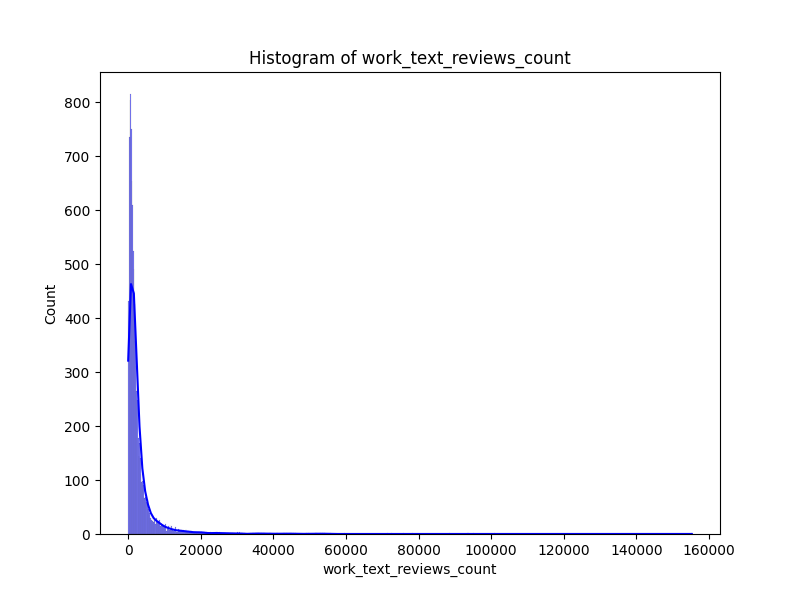
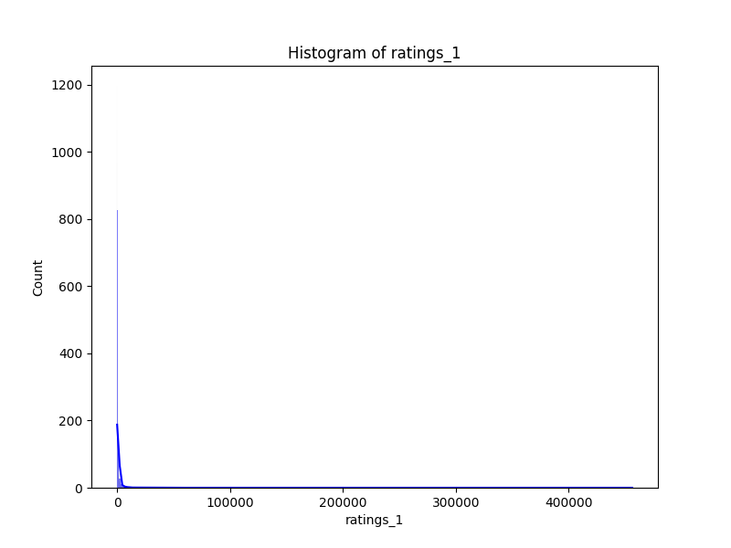

# Automated Data Analysis Report

## Dataset: goodreads.csv

### Basic Analysis
- Columns: ['book_id', 'goodreads_book_id', 'best_book_id', 'work_id', 'books_count', 'isbn', 'isbn13', 'authors', 'original_publication_year', 'original_title', 'title', 'language_code', 'average_rating', 'ratings_count', 'work_ratings_count', 'work_text_reviews_count', 'ratings_1', 'ratings_2', 'ratings_3', 'ratings_4', 'ratings_5', 'image_url', 'small_image_url']
- Missing Values: {'book_id': 0, 'goodreads_book_id': 0, 'best_book_id': 0, 'work_id': 0, 'books_count': 0, 'isbn': 700, 'isbn13': 585, 'authors': 0, 'original_publication_year': 21, 'original_title': 585, 'title': 0, 'language_code': 1084, 'average_rating': 0, 'ratings_count': 0, 'work_ratings_count': 0, 'work_text_reviews_count': 0, 'ratings_1': 0, 'ratings_2': 0, 'ratings_3': 0, 'ratings_4': 0, 'ratings_5': 0, 'image_url': 0, 'small_image_url': 0}

### Key Insights
### Dataset Analysis Story: Insights and Recommendations

#### Overview
The dataset comprises 10,000 unique book entries, featuring key attributes such as identifiers, publication details, authorship, and user ratings from Goodreads. It provides a comprehensive view of book popularity and user engagement within various genres and languages.

#### Key Insights

1. **Book Distribution and Popularity**:
   - The average rating across all books is approximately **4.00** (out of 5), indicating a generally high level of reader satisfaction. 
   - The dataset showcases a diversity of authors, with **4,664 unique authors**, suggesting a wide range of literary voices and styles available to readers, with Stephen King being the most frequent author with **60 entries**.

2. **Publication Trends**:
   - The **original publication year** averages around **1981**, with a notable range from as far back as **-1750** to **2017**. This suggests an extensive historical context for some titles, potentially appealing to readers of classic literature.
   - The median publication year of **2004** indicates a gradual shift towards more contemporary literature, capturing modern themes and styles that may resonate more with today's readers.

3. **ISBN Missing Data**:
   - There are missing values in the **ISBN** (700 missing) and **ISBN13** (585 missing) fields, which may affect the ability to accurately identify and catalog certain books. Addressing this data gap could enhance the dataset's overall integrity.

4. **Language Diversity**:
   - Only **8,916** of the entries specify a **language code**, with English being the most prevalent (over **6,341** entries). This presents an opportunity to explore translations or the need for additional multilingual options since only **25** unique languages are recorded.

5. **User Engagement and Ratings**:
   - The **ratings count** average is substantial (**54,001**), indicating a robust user engagement, but this varies significantly given the **high standard deviation (157,370)**. This highlights a few titles that may have received disproportionately large numbers of ratings, which can skew the analysis of popularity.
   - The breakdown of ratings shows a generally positive distribution, though the counts for lower ratings (e.g., ratings of **1** and **2**) are relatively low, suggesting that negative feedback is rarely expressed.

6. **Visual Insights**:
   - Preliminary correlation heatmap indicates potential relationships between user ratings and the number of ratings a book receives, suggesting that books with higher ratings also tend to accumulate more total ratings. Histograms of numeric columns reveal patterns in user engagement and satisfaction across different ratings.

#### Recommendations

1. **Data Integrity**:
   - It is essential to address missing values in ISBN and original titles to improve the dataset's accuracy. Implement automated checks or validations when acquiring new data to minimize such issues.

2. **Enhance Diversity**:
   - Focus on promoting translations of popular titles or sourcing works from underrepresented languages and authors, especially considering the current bias towards English literature in the dataset.

3. **Engagement Strategies**:
   - Develop targeted marketing strategies for books with high average ratings but lower ratings counts. Encouraging users to rate their favorite reads could balance and amplify underrepresented titles.

4. **User Feedback Mechanisms**:
   - Consider implementing more nuanced feedback mechanisms (like qualitative comments or genre-based reviews) to capture a more comprehensive view of reader satisfaction and preferences, enhancing engagement.

5. **Trend Analysis**:
   - Conduct further explorations into trends over time, particularly shifts in genres or themes that attract readers, to adapt content offerings and marketing efforts consistently.

By synthesizing this rich dataset and addressing its gaps, we can create a more engaging platform for readers while enriching their literary journeys.

### Visualizations

