# Automated Data Analysis Report for Goodreads

## Dataset: goodreads.csv

### Dataset Overview
- **Columns**: ['book_id', 'goodreads_book_id', 'best_book_id', 'work_id', 'books_count', 'isbn', 'isbn13', 'authors', 'original_publication_year', 'original_title', 'title', 'language_code', 'average_rating', 'ratings_count', 'work_ratings_count', 'work_text_reviews_count', 'ratings_1', 'ratings_2', 'ratings_3', 'ratings_4', 'ratings_5', 'image_url', 'small_image_url']
- **Missing Values**: {'book_id': 0, 'goodreads_book_id': 0, 'best_book_id': 0, 'work_id': 0, 'books_count': 0, 'isbn': 700, 'isbn13': 585, 'authors': 0, 'original_publication_year': 21, 'original_title': 585, 'title': 0, 'language_code': 1084, 'average_rating': 0, 'ratings_count': 0, 'work_ratings_count': 0, 'work_text_reviews_count': 0, 'ratings_1': 0, 'ratings_2': 0, 'ratings_3': 0, 'ratings_4': 0, 'ratings_5': 0, 'image_url': 0, 'small_image_url': 0}

### Key Insights
### Key Insights
1. **Large Dataset**: The dataset contains 10,000 entries, providing a robust base for analysis and insights into book characteristics and their reception.
2. **Missing Values**: Significant missing values exist in several key columns, particularly for `isbn`, `isbn13`, `original_publication_year`, `original_title`, and `language_code`. These gaps may impact certain analyses.
3. **Author Popularity**: Stephen King is the most frequently listed author, indicating that popular authors may dominate the dataset.
4. **Average Ratings**: The average rating across the dataset stands at approximately 4.00, suggesting a generally positive reception of the books.
5. **Genre and Language Distribution**: The dataset could be better understood with insights into the distribution of `language_code` and genres of the books, but it currently holds a notable proportion of books written in English.
6. **Publication Year Range**: The original publication year ranges from as far back as -1750 to 2017, showing a diverse historical presence of literature, though the majority appears to center around modern works (average around 1981).

### Dataset Overview
- **Columns**: The dataset includes 22 columns related to various book attributes, such as IDs, publication details, authors, ratings, and language codes.
- **Missing Data**: Certain columns have a considerable amount of missing data, notably `isbn` (700 missing), `isbn13` (585 missing), `original_publication_year` (21 missing), and `language_code` (1084 missing).
- **Quality of Ratings**: The dataset includes detailed ratings breakdown (1 to 5 stars), and there is a notable positive skew toward higher ratings.

### Key Findings
1. **ISBN Issues**: Almost 7% of records lack an ISBN, which could complicate efforts to track data across systems and databases.
2. **Publication Trends**: The original publication year averages around 1982, indicating a potential concentration of modern literature.
3. **Language Diversity**: Over 10% of rows have missing `language_code`, impacting the ability for multifaceted analysis by language.
4. **Ratings Insights**: High ratings are prevalent, with an average around 4.00 and a maximum of 4.82, suggesting books in this dataset are generally well-received.
5. **Review Activity**: The count of textual reviews is low compared to the ratings count, indicating possible underutilization of review features or a preference for numeric ratings among users.

### Recommendations
1. **Data Cleaning**: Cleaning the dataset to handle missing values should be prioritized, especially for critical columns like `isbn`, `original_title`, and `language_code`.
2. **Enhanced Data Capture**: Future dataset captures should aim to ensure key identifiers like ISBN are fully populated to facilitate data integrity.
3. **Detailed Genre Categorization**: Implement detailed categorization of genres, as this would aid further analysis on trends across different new and popular genres.
4. **Targeted Marketing for Authors**: Leverage insights about popular authors (e.g., Stephen King) for targeted marketing strategies or author-focused analyses.
5. **User Engagement Analysis**: Investigate user engagement with the review system to potentially enhance interaction with readers and increase textual review submissions.

### Conclusion
The dataset provides a wealth of information concerning books, ratings, and authors. While it shows generally positive reception trends and the prominence of certain authors like Stephen King, significant gaps in data require attention for more effective analysis. By cleaning the dataset, enhancing data capturing methods, and focusing on key areas such as genre categorization and user engagement, this dataset could yield even richer insights about literary preferences and market dynamics. Further analysis should prioritize understanding the missing data and how it may affect conclusions drawn from this dataset.

### Outlier Detection Results
Detected outliers in 'book_id': 0 rows
Detected outliers in 'goodreads_book_id': 345 rows
Detected outliers in 'best_book_id': 357 rows
Detected outliers in 'work_id': 601 rows
Detected outliers in 'books_count': 844 rows
Detected outliers in 'isbn13': 556 rows
Detected outliers in 'original_publication_year': 1031 rows
Detected outliers in 'average_rating': 158 rows
Detected outliers in 'ratings_count': 1163 rows
Detected outliers in 'work_ratings_count': 1143 rows
Detected outliers in 'work_text_reviews_count': 1005 rows
Detected outliers in 'ratings_1': 1140 rows
Detected outliers in 'ratings_2': 1156 rows
Detected outliers in 'ratings_3': 1149 rows
Detected outliers in 'ratings_4': 1131 rows
Detected outliers in 'ratings_5': 1158 rows

### Feature Importance Analysis
|    | Feature                   |   Importance |
|---:|:--------------------------|-------------:|
|  9 | work_ratings_count        |  0.654384    |
|  8 | ratings_count             |  0.175535    |
|  0 | book_id                   |  0.0859777   |
| 14 | ratings_4                 |  0.0342186   |
|  7 | average_rating            |  0.0284366   |
| 10 | work_text_reviews_count   |  0.00505613  |
| 11 | ratings_1                 |  0.00386697  |
|  1 | goodreads_book_id         |  0.00239981  |
| 12 | ratings_2                 |  0.00218948  |
| 13 | ratings_3                 |  0.00189434  |
|  6 | original_publication_year |  0.00145861  |
|  4 | books_count               |  0.00143634  |
|  5 | isbn13                    |  0.0012705   |
|  3 | work_id                   |  0.00126954  |
|  2 | best_book_id              |  0.000606341 |

### Visualizations

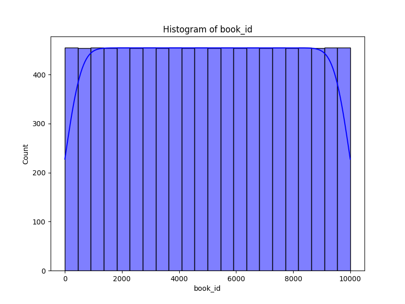
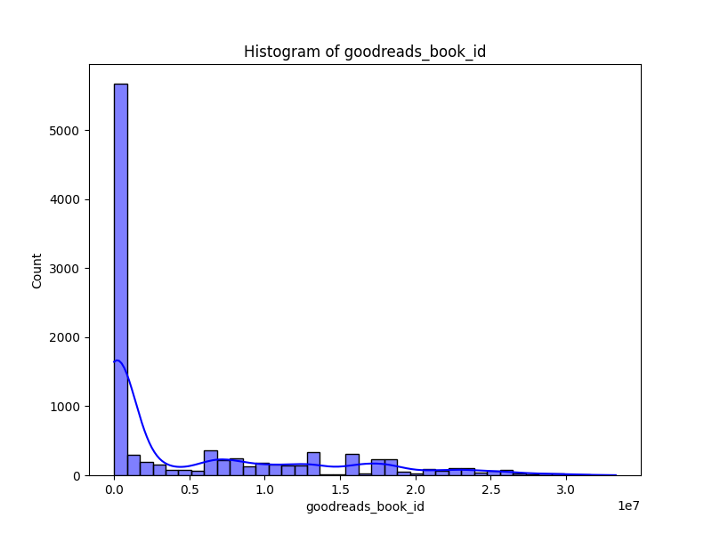
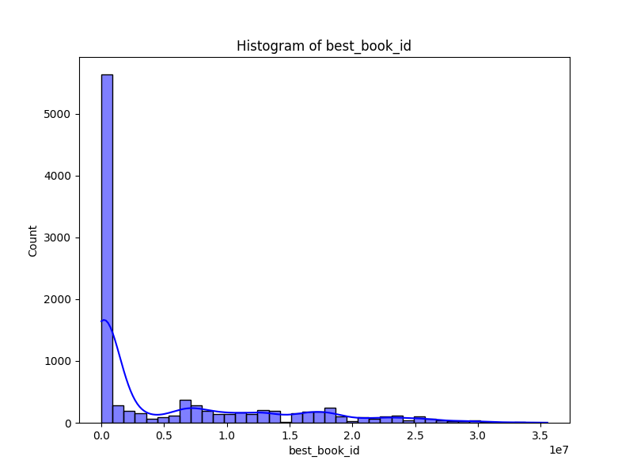
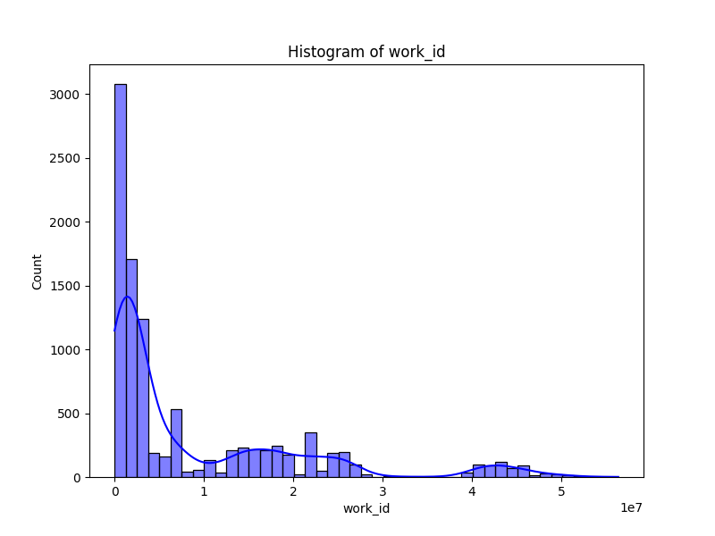
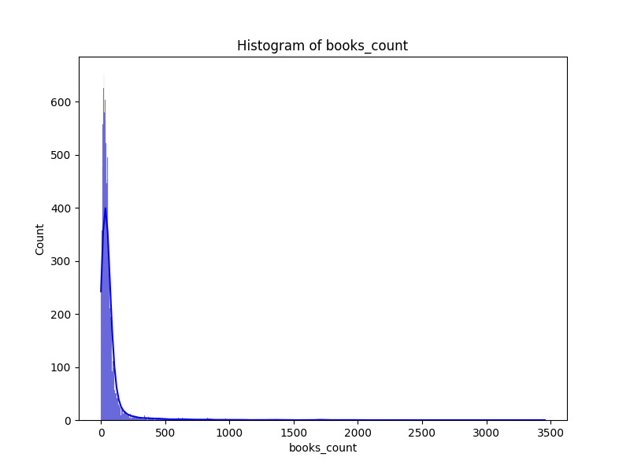
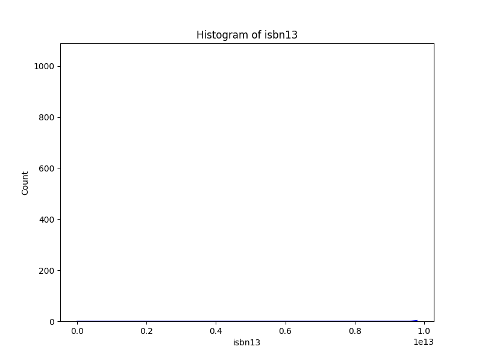
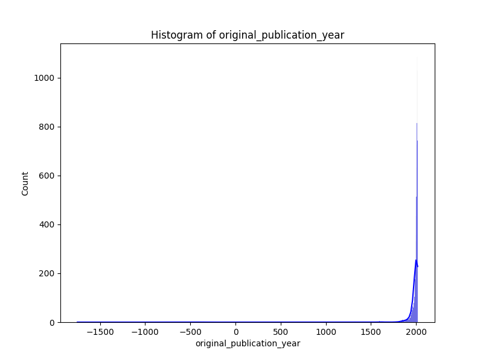
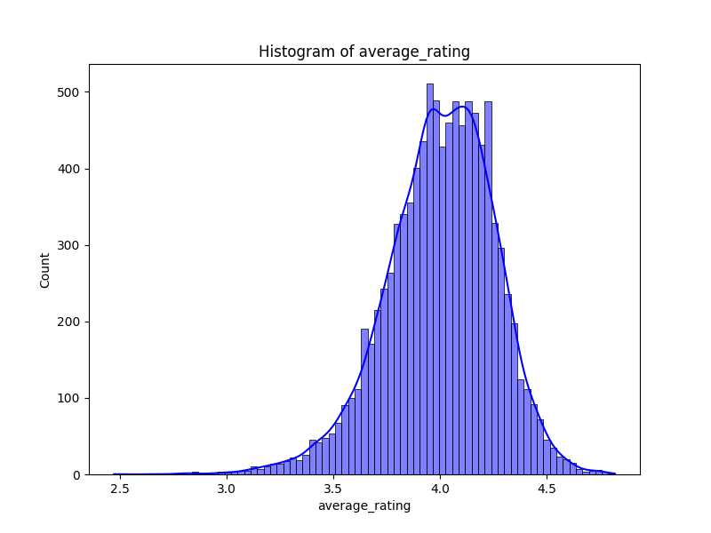
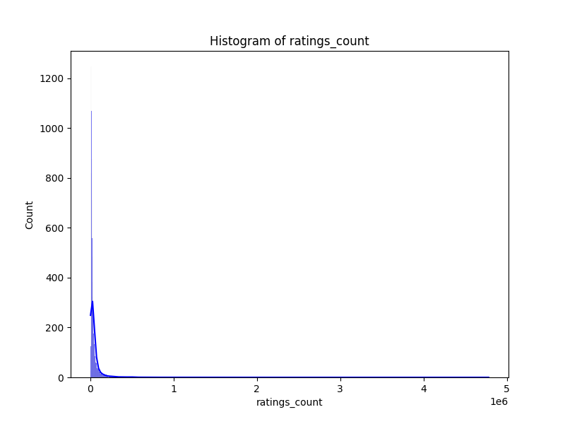
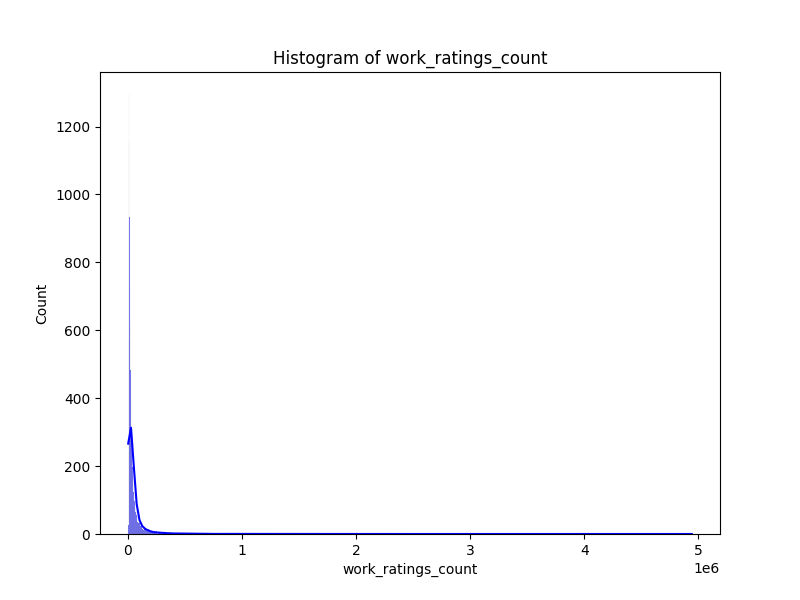
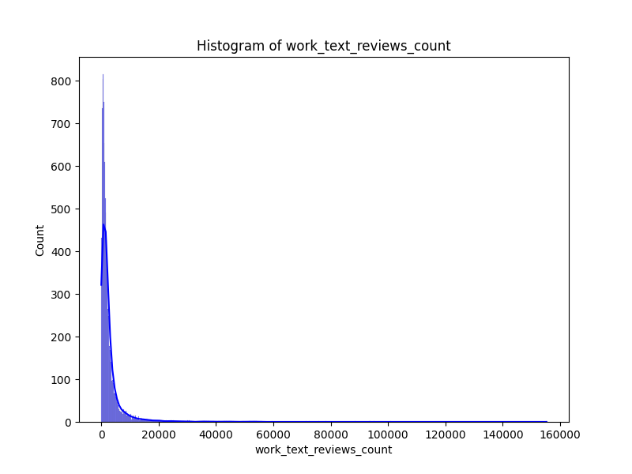
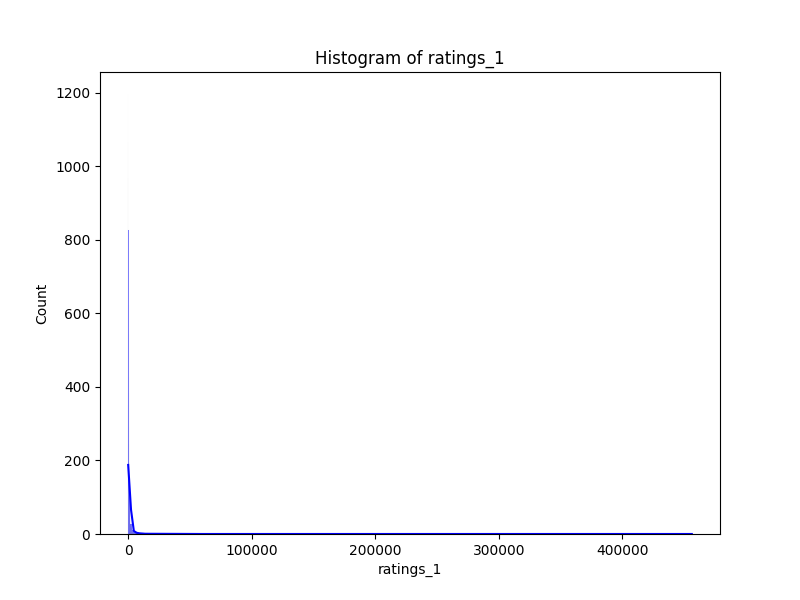
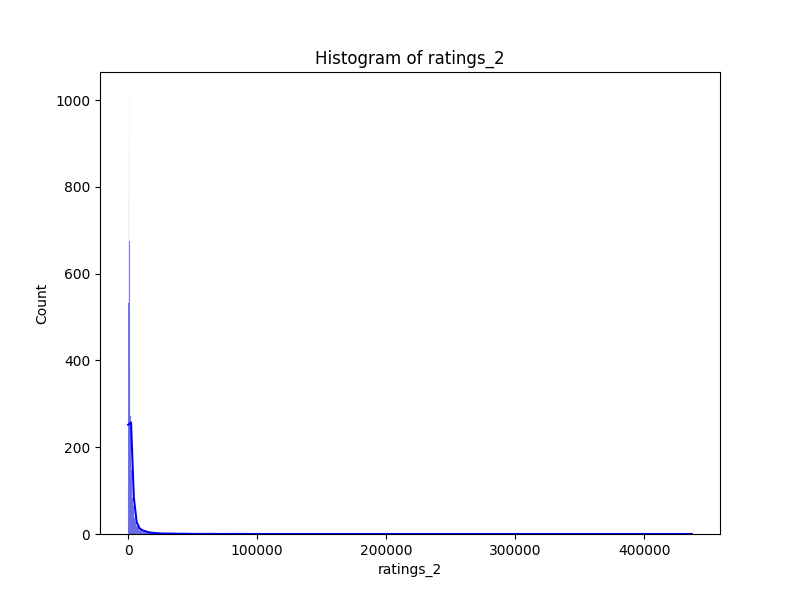
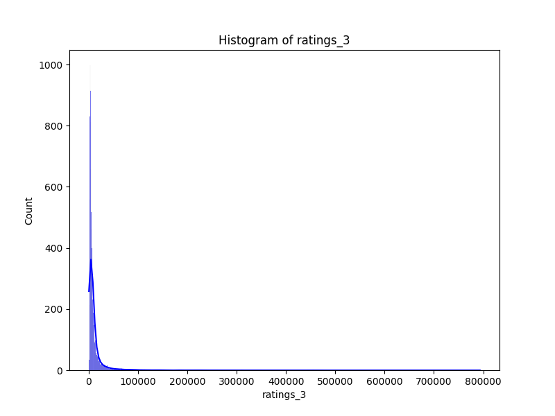

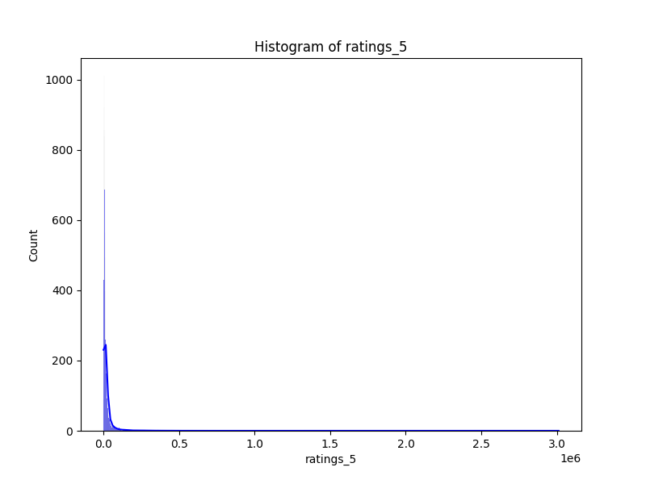
