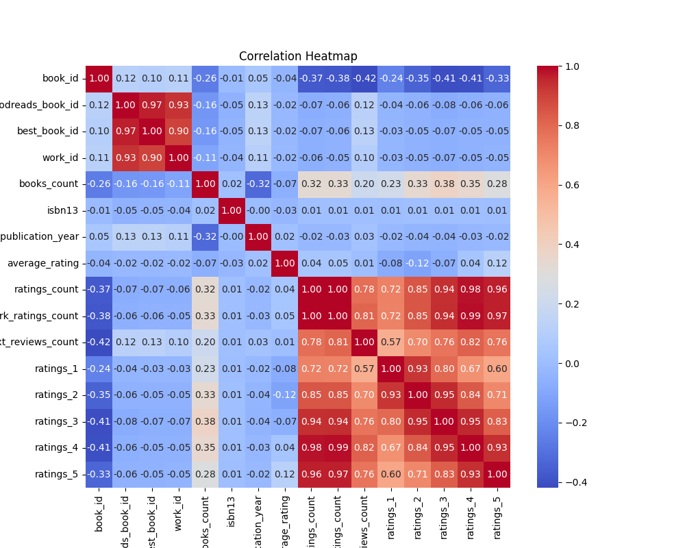
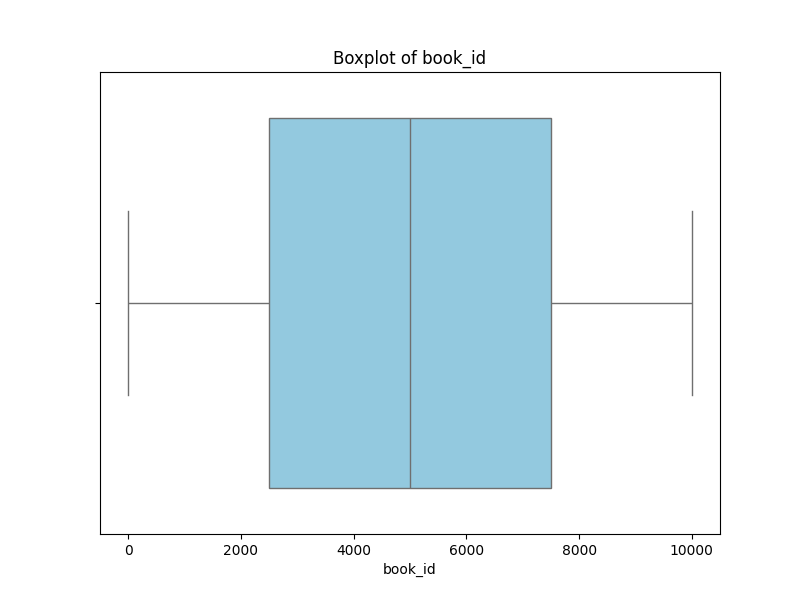
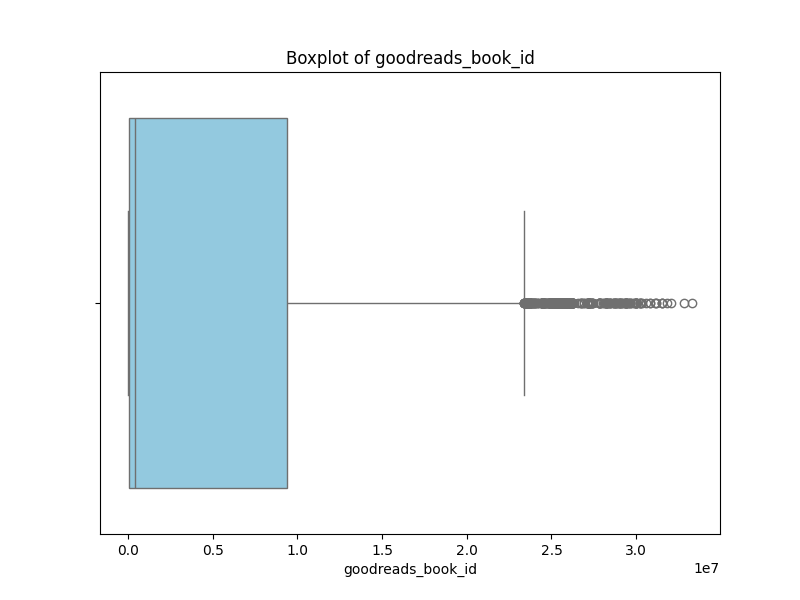
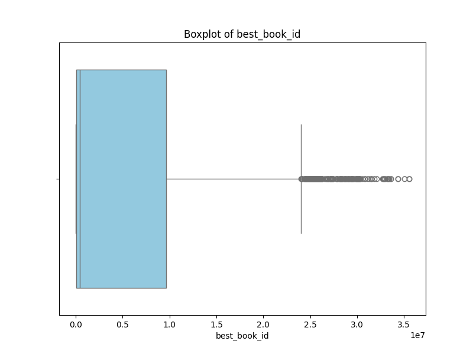
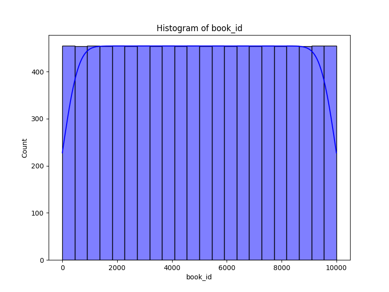
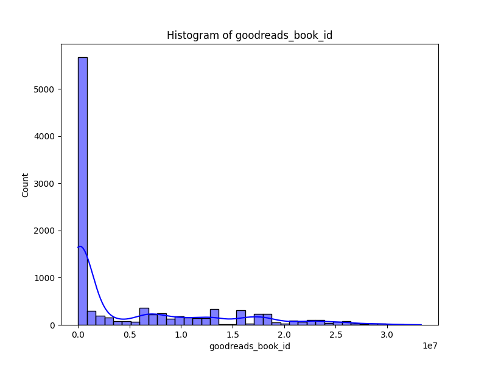
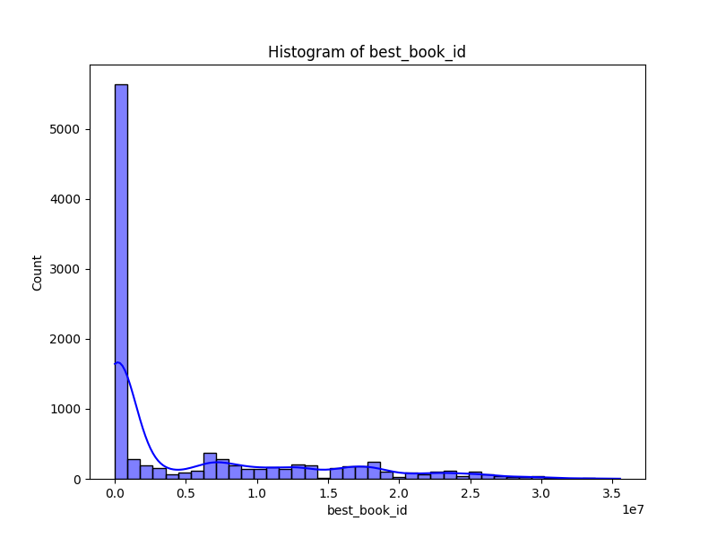

# Automated Data Analysis Report for Goodreads

## Dataset: goodreads.csv

### Dataset Overview
- **Columns**: ['book_id', 'goodreads_book_id', 'best_book_id', 'work_id', 'books_count', 'isbn', 'isbn13', 'authors', 'original_publication_year', 'original_title', 'title', 'language_code', 'average_rating', 'ratings_count', 'work_ratings_count', 'work_text_reviews_count', 'ratings_1', 'ratings_2', 'ratings_3', 'ratings_4', 'ratings_5', 'image_url', 'small_image_url']
- **Missing Values**: {'book_id': 0, 'goodreads_book_id': 0, 'best_book_id': 0, 'work_id': 0, 'books_count': 0, 'isbn': 700, 'isbn13': 585, 'authors': 0, 'original_publication_year': 21, 'original_title': 585, 'title': 0, 'language_code': 1084, 'average_rating': 0, 'ratings_count': 0, 'work_ratings_count': 0, 'work_text_reviews_count': 0, 'ratings_1': 0, 'ratings_2': 0, 'ratings_3': 0, 'ratings_4': 0, 'ratings_5': 0, 'image_url': 0, 'small_image_url': 0}

### Key Insights
1. **Data Volume**: The dataset consists of 10,000 entries and includes various metrics about the books, such as ratings, authorship, and publication details.
2. **Missing Values**: Important columns like `isbn`, `isbn13`, `original_publication_year`, and `original_title` have significant missing values, which may impact analysis and inference.
3. **High Ratings and Reviews**: The average rating across books is approximately 4.00, indicating positive reception. However, a higher standard deviation suggests variability in ratings.
4. **Outlier Detection**: A considerable number of outliers were found in multiple columns, particularly in ratings and review counts. This highlights the presence of extreme values that could skew analysis.

### Dataset Overview
- **Columns**: The dataset contains 22 columns relating to book metadata, including identifiers (e.g., `book_id`, `isbn`), authorship (`authors`), publication details (`original_publication_year`, `original_title`), and ratings (`average_rating`, `ratings_count`).
- **Missing Values**: Significant missing data includes:
  - `isbn`: 700 missing
  - `isbn13`: 585 missing
  - `original_publication_year`: 21 missing
  - `original_title`: 585 missing
  - `language_code`: 1084 missing
- **Basic Statistics**: Most columns exhibit a normal distribution, although some (e.g., `ratings_count` and `work_ratings_count`) are heavily skewed towards higher values due to outliers.

### Key Findings
1. **Top Authors**: Stephen King is the most frequent author (60 occurrences), indicating potential popularity or prominence in the dataset.
2. **Publication Years**: The mean original publication year is around 1982, with a maximum of 2017, showing a wide range of book ages included in the analysis.
3. **Outlier Prevalence**: Significant outliers were detected in several key metrics, such as `ratings_count` (1163 outliers) and `ratings_5` (1158 outliers), suggesting that a handful of books have received an extraordinarily high number of ratings or reviews, possibly skewing overall metrics.
4. **Feature Importance**: The most influential features for predicting ratings or reviews are `work_ratings_count` and `ratings_count`, indicating that higher activity leads to better rating outcomes.

### Recommendations
1. **Handling Missing Values**: Address missing entries by employing appropriate imputation techniques or considering removal based on the analysis's needs. For example, books with missing `isbn` or `isbn13` could be excluded from bibliographic analyses.
2. **Outlier Management**: Consider analyzing or adjusting outlier data to mitigate the skewing effects on analyses, as their influence on average metrics can lead to misinterpretations.
3. **Further Analysis of Ratings**: Explore the correlation between author popularity and ratings to understand better trends among highly rated books and prominent authors.
4. **Focus on Exceptional Cases**: Investigate the books identified as outliers for deeper insights—they may be new hits, cult classics, or unnoticed gems.

### Conclusions
The dataset provides a rich landscape for understanding book ratings and author visibility within the literary community. While there are challenges regarding missing data and outliers, the overall insights suggest a favorable reception for most books in the dataset, with certain authors notably excelling. Future analyses should account for these data integrity aspects and could focus on broader patterns and trends in book readership and engagement. Implementing the recommendations will help enhance the accuracy and reliability of further analyses based on this dataset.

### Outlier Detection Results
Detected outliers in 'book_id': 0 rows
Detected outliers in 'goodreads_book_id': 345 rows
Detected outliers in 'best_book_id': 357 rows
Detected outliers in 'work_id': 601 rows
Detected outliers in 'books_count': 844 rows
Detected outliers in 'isbn13': 556 rows
Detected outliers in 'original_publication_year': 1031 rows
Detected outliers in 'average_rating': 158 rows
Detected outliers in 'ratings_count': 1163 rows
Detected outliers in 'work_ratings_count': 1143 rows
Detected outliers in 'work_text_reviews_count': 1005 rows
Detected outliers in 'ratings_1': 1140 rows
Detected outliers in 'ratings_2': 1156 rows
Detected outliers in 'ratings_3': 1149 rows
Detected outliers in 'ratings_4': 1131 rows
Detected outliers in 'ratings_5': 1158 rows

### Feature Importance Analysis
|    | Feature                   |   Importance |
|---:|:--------------------------|-------------:|
|  9 | work_ratings_count        |  0.654384    |
|  8 | ratings_count             |  0.175535    |
|  0 | book_id                   |  0.0859777   |
| 14 | ratings_4                 |  0.0342186   |
|  7 | average_rating            |  0.0284366   |
| 10 | work_text_reviews_count   |  0.00505613  |
| 11 | ratings_1                 |  0.00386697  |
|  1 | goodreads_book_id         |  0.00239981  |
| 12 | ratings_2                 |  0.00218948  |
| 13 | ratings_3                 |  0.00189434  |
|  6 | original_publication_year |  0.00145861  |
|  4 | books_count               |  0.00143634  |
|  5 | isbn13                    |  0.0012705   |
|  3 | work_id                   |  0.00126954  |
|  2 | best_book_id              |  0.000606341 |

### Visualizations

## Suggestions

Based on the dataset summary provided, here are several analyses that could yield meaningful insights:

1. **Popularity Analysis**:
   - Analyze the distribution of average ratings (`average_rating`), `ratings_count`, and `work_ratings_count` to determine which books are the most popular among readers.
   - Create a scatter plot between `ratings_count` and `average_rating` to investigate if higher ratings correlate with more reviews.

2. **Author Performance**:
   - Group the dataset by `authors` to find out which authors have the highest average ratings and total book counts.
   - Identify authors with consistent high ratings versus those with very few ratings, potentially highlighting breakout authors.

3. **Publication Trends**:
   - Analyze the distribution of `original_publication_year` to observe trends in book publication over the years.
   - Investigate whether there is a relationship between the publication year and the average rating to identify if newer or older books are rated higher on average.

4. **Language Influence**:
   - Examine how the `language_code` impacts the average rating and ratings count. This could reveal preferences in different language segments.
   - Identify the top-rated languages and compare their distribution with the overall dataset.

5. **ISBN Analysis**:
   - Conduct a frequency analysis of missing `isbn` and `isbn13` values, assessing the potential impact on the dataset.
   - Explore if books with complete ISBN data show different trends in average ratings or ratings counts compared to those without.

6. **Rating Distribution**:
   - Analyze the distribution of `ratings_1` to `ratings_5` to identify common rating patterns and user sentiments for books.
   - Assess whether there are patterns in rating distribution based on genres (if genre information were available).

7. **Image Analysis**:
   - Investigate how having an image (`image_url` and `small_image_url`) correlates with average ratings or total ratings received, hypothesizing that books with images may perform better.

8. **Top Books Analysis**:
   - List the top-rated books and analyze their characteristics (e.g., publication year, author, languages) to understand what features contribute to high ratings.
   - Create a word cloud from the `title` or `original_title` of the books with the highest ratings to visualize common themes or genres.

9. **Missing Data Impact**:
   - Analyze the books with missing values for `isbn`, `isbn13`, or `original_title` to see how the missing data correlates with ratings or overall popularity.
   - Investigate whether the missing `original_publication_year` has an impact on ratings and overall readership.

10. **Correlation Matrix**:
    - Create a correlation matrix for numerical variables such as `average_rating`, `ratings_count`, `work_ratings_count`, and the different ratings to find any strong relationships or significant factors affecting book popularity.

11. **Recommendation System Insights**:
    - Using average ratings and ratings counts, develop a basic recommendation algorithm to suggest books based on popularity. This could yield actionable insights for book recommendations.

These analyses could lead to actionable insights for publishers, authors, or readers, helping to understand market trends or reader preferences better.

