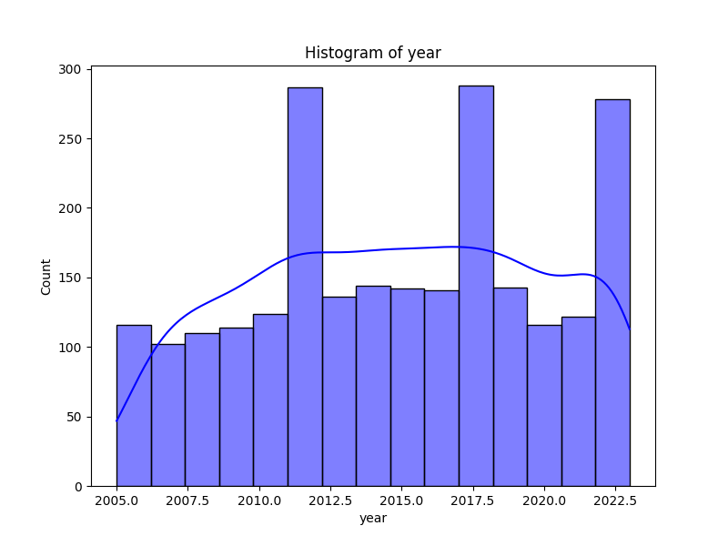
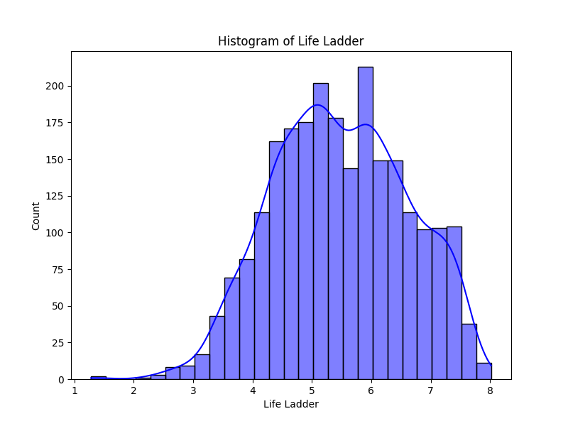
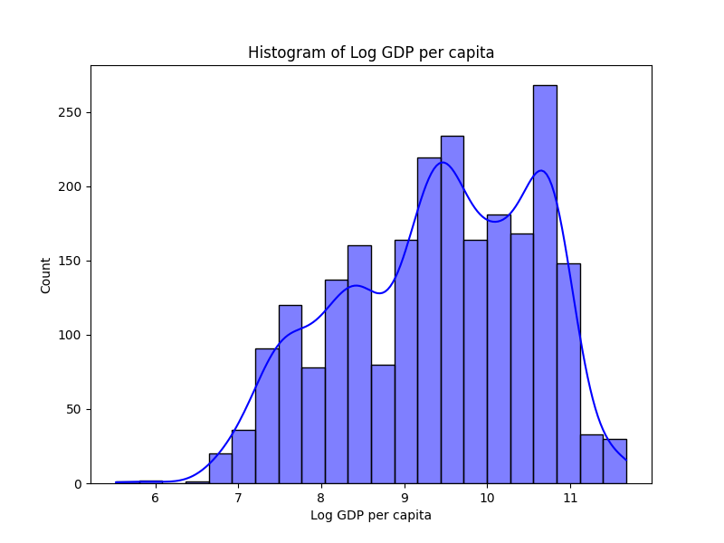
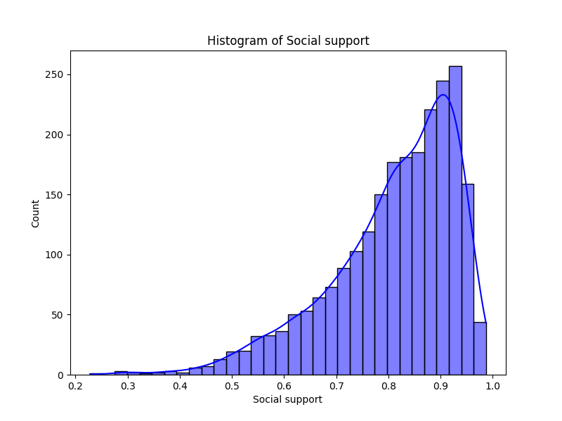
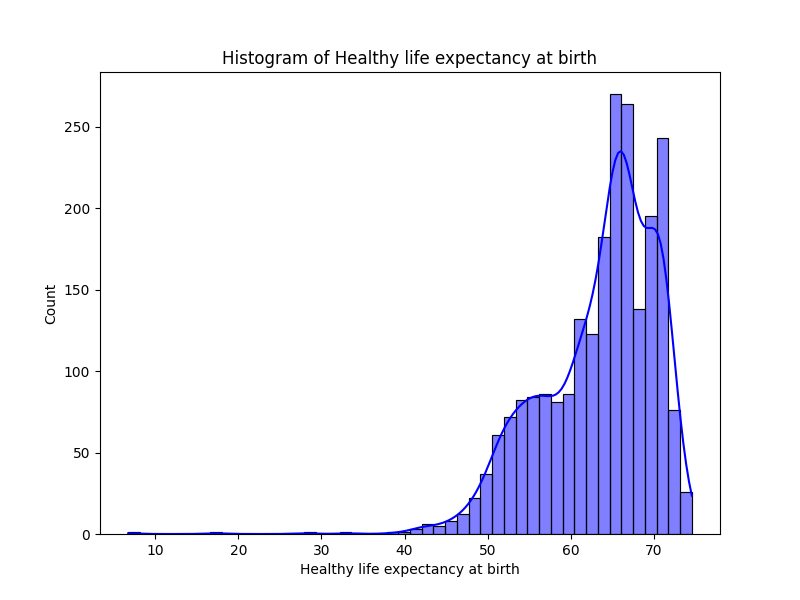
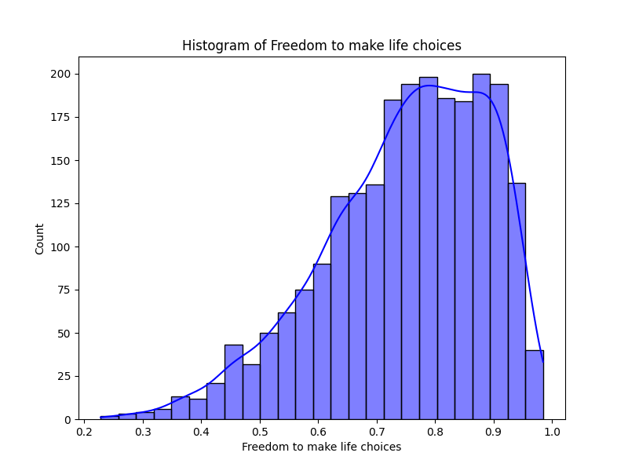
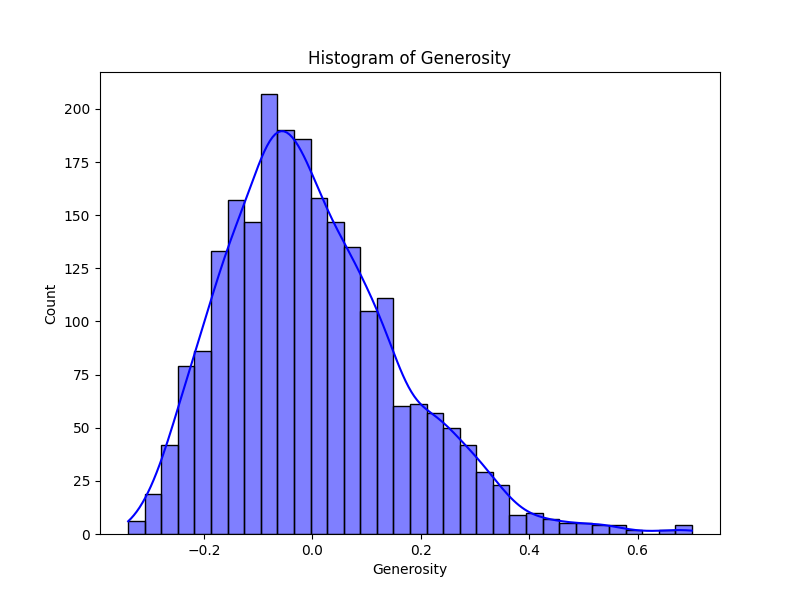
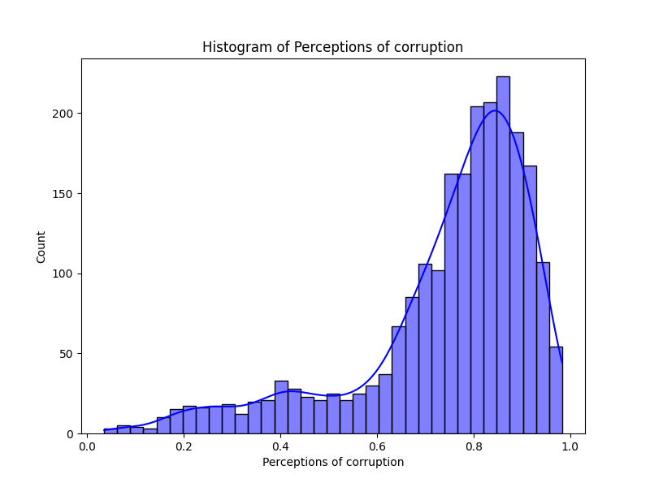
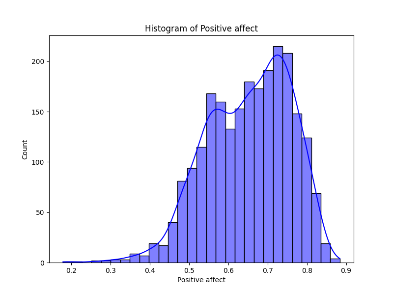
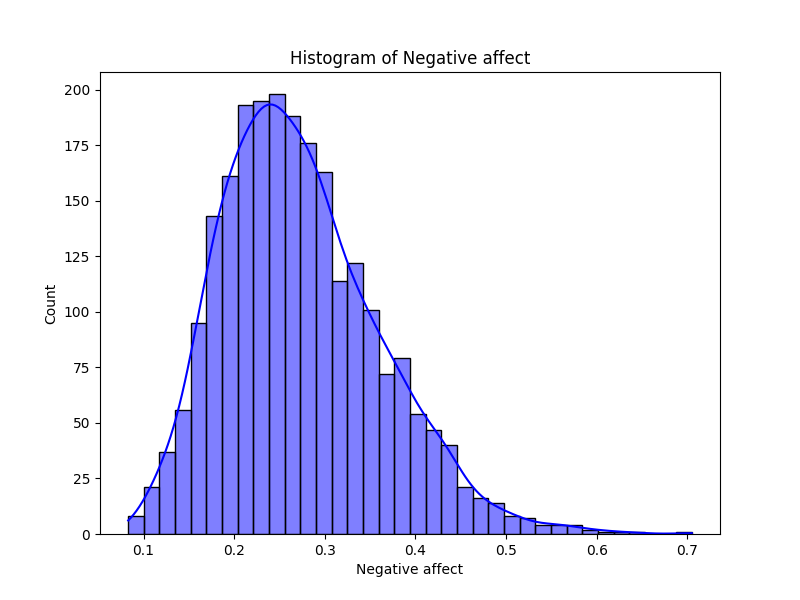

# Automated Data Analysis Report for Happiness

## Dataset: happiness.csv

### Dataset Overview
- **Columns**: ['Country name', 'year', 'Life Ladder', 'Log GDP per capita', 'Social support', 'Healthy life expectancy at birth', 'Freedom to make life choices', 'Generosity', 'Perceptions of corruption', 'Positive affect', 'Negative affect']
- **Missing Values**: {'Country name': 0, 'year': 0, 'Life Ladder': 0, 'Log GDP per capita': 28, 'Social support': 13, 'Healthy life expectancy at birth': 63, 'Freedom to make life choices': 36, 'Generosity': 81, 'Perceptions of corruption': 125, 'Positive affect': 24, 'Negative affect': 16}

### Key Insights

1. **Missing Values:** Several key columns in the dataset have missing values, particularly 'Generosity' (81 missing), 'Perceptions of corruption' (125 missing), and 'Healthy life expectancy at birth' (63 missing), indicating potential areas for data collection improvement.
  
2. **Life Ladder Trends:** The average 'Life Ladder' score is 5.48, suggesting moderate life satisfaction across the dataset. The distribution of values indicates variability, with a range from 1.281 to 8.019.

3. **Economic Indicators:** The mean 'Log GDP per capita' value is approximately 9.4, correlating with life satisfaction measures. This suggests a relationship between economic prosperity and perceived well-being.

4. **Social Support and Health:** 'Social support' and 'Healthy life expectancy at birth' are significant factors impacting life satisfaction, with importance scores suggesting that these features may significantly contribute to overall well-being measures.

5. **Clustering Results:** K-Means clustering revealed 3 distinct clusters, indicating that various groups of countries exhibit similar characteristics concerning life satisfaction and its correlates.

### Dataset Overview

- **Columns Included:**
  - **Demographics:** 'Country name', 'year'
  - **Life Satisfaction Metrics:** 'Life Ladder', 'Positive affect', 'Negative affect'
  - **Economic Indicators:** 'Log GDP per capita', 'Generosity'
  - **Social Metrics:** 'Social support', 'Healthy life expectancy at birth', 'Freedom to make life choices', 'Perceptions of corruption'
  
- **Sample Size:** The dataset consists of 2363 entries across 165 unique countries.

- **Statistical Overview:** A variety of statistical measures are available, including means, standard deviations, and ranges for each quantitative feature.

### Key Findings

1. **Outlier Detection:** Outliers were identified in several features, notably in 'Perceptions of corruption' (194 rows), suggesting extreme values that may skew analyses and require careful consideration in interpretation.

2. **Key Predictors of Life Satisfaction:** The analysis highlights 'Social support' and 'Healthy life expectancy at birth' as the top features impacting life satisfaction, which should be a focal point for policymakers.

3. **Significant Missing Data:** Missing data is a significant concern, particularly in the 'Generosity' variable, influencing the robustness of predictive models and the interpretations of correlations.

### Recommendations

1. **Data Cleaning:** Address the missing values through imputation or data enrichment processes to ensure a more robust analysis.

2. **Focus on Social Policies:** Policymakers should prioritize initiatives that enhance social support systems and health services, as these are closely linked with improved life satisfaction.

3. **Outlier Management:** Investigate the reasons behind identified outliers to account for their influence on overall trends and correlations.

4. **Segmentation Strategies:** Utilize the clustering results to develop tailored policies for different groups of countries based on their unique characteristics associated with life satisfaction.

### Conclusions

The dataset reveals valuable insights into the interplay between economic, social, and health factors affecting life satisfaction across countries. Robust processes for dealing with missing data, outlier management, and strategic focus areas for policy interventions are critical for enhancing life factors and overall well-being. Future analyses should explore deeper correlations and potential causal relationships among the various metrics to provide even greater clarity on improving quality of life globally.

### Outlier Detection Results
Detected outliers in 'year': 0 rows
Detected outliers in 'Life Ladder': 2 rows
Detected outliers in 'Log GDP per capita': 1 rows
Detected outliers in 'Social support': 48 rows
Detected outliers in 'Healthy life expectancy at birth': 20 rows
Detected outliers in 'Freedom to make life choices': 16 rows
Detected outliers in 'Generosity': 39 rows
Detected outliers in 'Perceptions of corruption': 194 rows
Detected outliers in 'Positive affect': 9 rows
Detected outliers in 'Negative affect': 31 rows

### Feature Importance Analysis
|    | Feature                          |   Importance |
|---:|:---------------------------------|-------------:|
|  3 | Social support                   |    0.27151   |
|  4 | Healthy life expectancy at birth |    0.107936  |
|  2 | Log GDP per capita               |    0.105402  |
|  0 | year                             |    0.104132  |
|  8 | Positive affect                  |    0.103446  |
|  7 | Perceptions of corruption        |    0.0899058 |
|  5 | Freedom to make life choices     |    0.074778  |
|  1 | Life Ladder                      |    0.0742228 |
|  6 | Generosity                       |    0.0686676 |

### Correlation Analysis
Correlation Matrix saved as C:\Users\Abdul Hadi\Desktop\TdsProject2\happiness\correlation_matrix.png

### Clustering Analysis
K-Means clustering successfully performed with 3 clusters on numeric columns: ['year', 'Life Ladder', 'Log GDP per capita', 'Social support', 'Healthy life expectancy at birth', 'Freedom to make life choices', 'Generosity', 'Perceptions of corruption', 'Positive affect', 'Negative affect']. Results plotted in two dimensions.

### Distribution Analysis
Boxplot created for year.
Boxplot created for Life Ladder.
Boxplot created for Log GDP per capita.
Boxplot created for Social support.
Boxplot created for Healthy life expectancy at birth.
Boxplot created for Freedom to make life choices.
Boxplot created for Generosity.
Boxplot created for Perceptions of corruption.
Boxplot created for Positive affect.
Boxplot created for Negative affect.

### Visualizations

