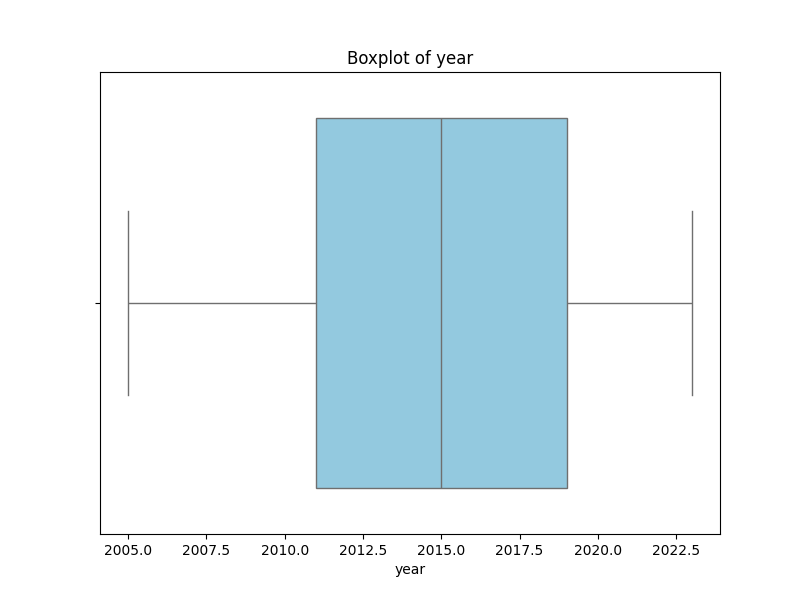
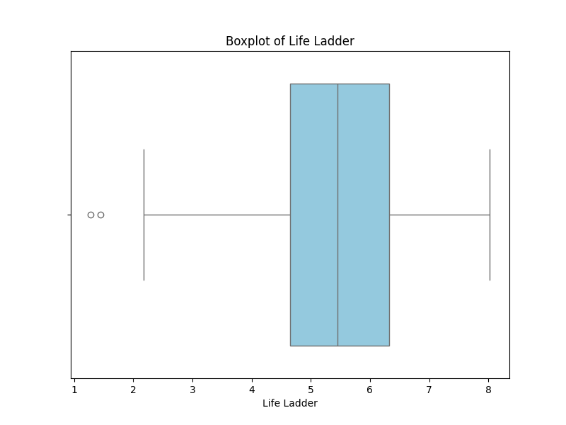
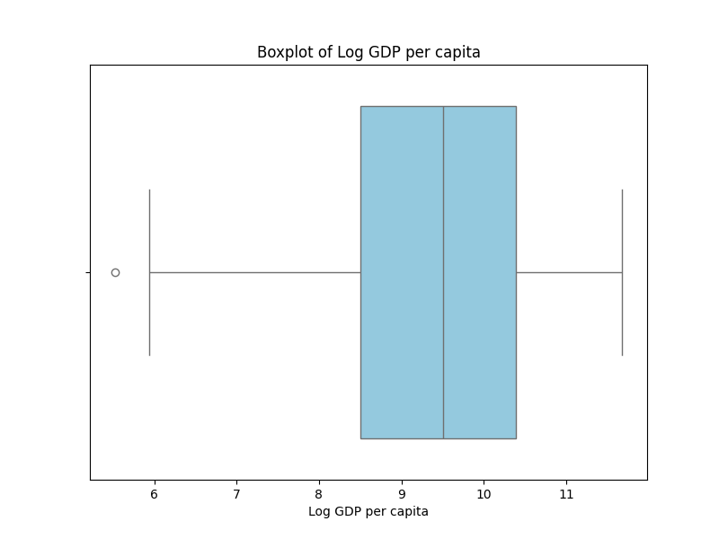

# Automated Data Analysis Report for Happiness

## Dataset: happiness.csv

### Dataset Overview
- **Columns**: ['Country name', 'year', 'Life Ladder', 'Log GDP per capita', 'Social support', 'Healthy life expectancy at birth', 'Freedom to make life choices', 'Generosity', 'Perceptions of corruption', 'Positive affect', 'Negative affect']
- **Missing Values**: {'Country name': 0, 'year': 0, 'Life Ladder': 0, 'Log GDP per capita': 28, 'Social support': 13, 'Healthy life expectancy at birth': 63, 'Freedom to make life choices': 36, 'Generosity': 81, 'Perceptions of corruption': 125, 'Positive affect': 24, 'Negative affect': 16}

### Key Insights
1. **Data Richness**: The dataset contains 2,363 records across 165 unique countries, featuring various socio-economic and well-being indicators.
2. **Missing Values**: Significant missing data in key features such as Generosity (81 missing), Perceptions of Corruption (125 missing), and Healthy Life Expectancy (63 missing) could impact analyses and results.
3. **Feature Importance**: Key predictors of well-being, as measured by the Life Ladder, include Social Support, Health, and Economic factors, which highlights the multidimensional nature of happiness and life satisfaction.
4. **Outlier Detection**: Numerous outliers were detected in various fields, particularly in Perceptions of Corruption (194) and Generosity (39), indicating the existence of extreme values which may skew results.

### Dataset Overview
- **Columns**: The dataset includes countries, years (2005-2023), and various measures of well-being such as Life Ladder, GDP per capita, Social Support, Healthy Life Expectancy, Freedom, Generosity, Corruption perceptions, and emotional indicators.
- **Missing Values**: Notable missing values for Log GDP per capita (28), Social support (13), and Generosity (81) raise concerns regarding the completeness of the dataset.
- **Statistical Summary**: The average Life Ladder score is 5.48, with a standard deviation of 1.13, indicating varying levels of life satisfaction across the countries examined.

### Key Findings
1. **Life Satisfaction Correlates**: Life Ladder scores are positively correlated with Social Support and Healthy Life Expectancy, suggesting that countries with stronger social networks and better health outcomes report higher life satisfaction.
2. **GDP and Well-Being**: The average Log GDP per capita is 9.40, indicating relatively high economic development among the countries, but the variance suggests unequal wealth distribution.
3. **Perception of Corruption**: A high number of outliers in perceptions of corruption suggests variances in trust in governmental institutions across different countries.

### Recommendations
1. **Handling Missing Data**: Consider imputation techniques to address missing values, particularly for critical variables like Generosity and Perceptions of Corruption, to enhance data robustness.
2. **Outlier Management**: Review the detected outliers to determine if they represent genuine cases that warrant further investigation or if they should be excluded from analyses.
3. **Feature Analysis**: Perform a deeper analysis on the most influential factors (e.g., Social Support, Health) to understand their specific impacts on life satisfaction and potential interventions.

### Conclusions
The dataset offers a comprehensive view into the socio-economic and emotional well-being of populations across numerous countries. Despite challenges with missing data and outlier values, the key insights into the significance of social and health-related factors on life satisfaction present opportunities for further research. Addressing the identified issues and analyzing the feature importance can lead to informed recommendations for policy improvements aimed at enhancing overall quality of life.

### Outlier Detection Results
Detected outliers in 'year': 0 rows
Detected outliers in 'Life Ladder': 2 rows
Detected outliers in 'Log GDP per capita': 1 rows
Detected outliers in 'Social support': 48 rows
Detected outliers in 'Healthy life expectancy at birth': 20 rows
Detected outliers in 'Freedom to make life choices': 16 rows
Detected outliers in 'Generosity': 39 rows
Detected outliers in 'Perceptions of corruption': 194 rows
Detected outliers in 'Positive affect': 9 rows
Detected outliers in 'Negative affect': 31 rows

### Feature Importance Analysis
|    | Feature                          |   Importance |
|---:|:---------------------------------|-------------:|
|  3 | Social support                   |    0.27151   |
|  4 | Healthy life expectancy at birth |    0.107936  |
|  2 | Log GDP per capita               |    0.105402  |
|  0 | year                             |    0.104132  |
|  8 | Positive affect                  |    0.103446  |
|  7 | Perceptions of corruption        |    0.0899058 |
|  5 | Freedom to make life choices     |    0.074778  |
|  1 | Life Ladder                      |    0.0742228 |
|  6 | Generosity                       |    0.0686676 |

### Correlation Heatmap

### Boxplots

### Histograms

## Suggestions

Based on the provided dataset summary, here are some analyses that could yield meaningful insights:

1. **Correlation Analysis**:
   - Examine the correlation between different factors and the 'Life Ladder' (a measure of subjective well-being). This can help identify which factors (e.g., Log GDP per capita, Social support, Healthy life expectancy at birth) are most strongly associated with higher life satisfaction.

2. **Trend Analysis**:
   - Analyze the trends of key indicators over the years. For example, track changes in 'Life Ladder', 'Log GDP per capita', and 'Social support' over time for different countries. Use line graphs to visualize these trends.

3. **Comparison by Region**:
   - Group countries by region (if the information is available or can be inferred) and compare average scores across different metrics like 'Life Ladder', 'Freedom to make life choices', and others. This can highlight regional differences in well-being.

4. **Predictive Modeling**:
   - Build a predictive model to forecast 'Life Ladder' scores based on factors like 'Log GDP per capita', 'Social support', and 'Healthy life expectancy at birth'. Techniques like linear regression or machine learning models could be applied.

5. **Missing Values Analysis**:
   - Investigate the patterns and causes behind the missing values in certain columns (e.g., 'Generosity' and 'Perceptions of corruption'). Assess if specific countries or years are disproportionately affected, which could impact the robustness of analyses.

6. **Clustering**:
   - Use clustering algorithms (e.g., K-means) to segment countries based on their scores in different metrics. This clustering can help identify groups of countries with similar profiles, which may point to distinct socio-economic conditions or cultural contexts.

7. **Impact of GDP on Well-Being**:
   - Conduct a regression analysis to understand how changes in 'Log GDP per capita' influence 'Life Ladder' and other well-being measures. Investigate whether there is a diminishing return of GDP on happiness, indicated by possible nonlinear relationships.

8. **Exploring Happiness Factors**:
   - Analyze the individual contributions of 'Generosity' and 'Perceptions of corruption' to well-being as measured by 'Life Ladder'. This can provide insights into the social aspects contributing to life satisfaction.

9. **Time-Series Analysis**:
   - Conduct time-series analyses to detect any significant seasonality or cyclical patterns in the data over the years across different metrics.

10. **Multivariate Analysis**:
    - Perform a multivariate analysis to explore the interactions among all independent variables and their collective impact on 'Life Ladder'. This can help identify any compound effects.

11. **Extreme Value Analysis**:
    - Identify countries with extreme values (very high or very low) in 'Life Ladder' and investigate the factors contributing to their unique cases.

12. **Health and Well-Being**:
    - Investigate how 'Healthy life expectancy at birth' relates to 'Life Ladder' and other social factors. This could provide insights into the importance of health in influencing happiness.

These analyses can produce actionable insights for policymakers, researchers, and stakeholders interested in understanding well-being and its determinants across different regions and over time.

