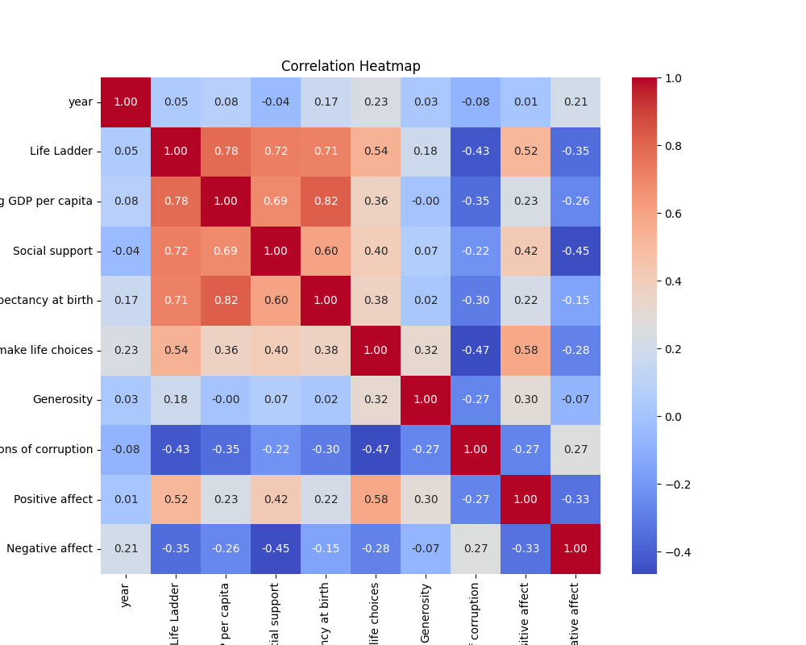
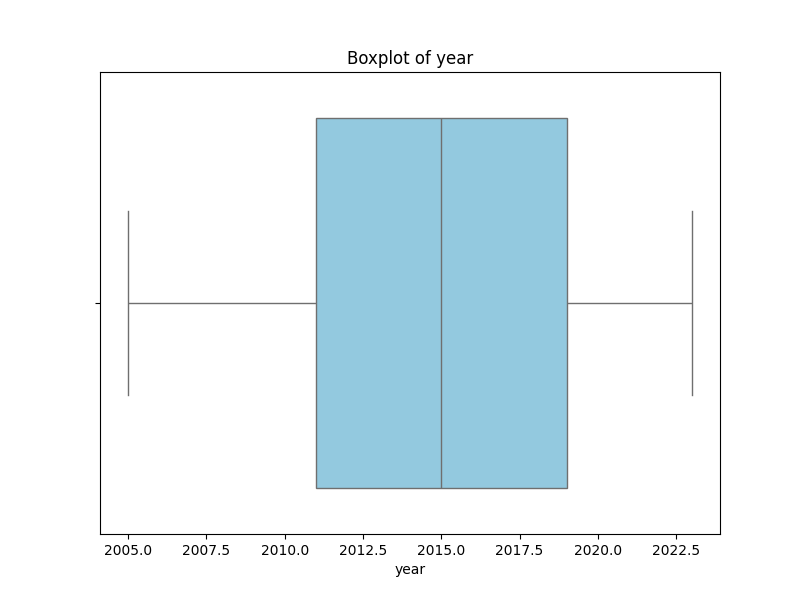
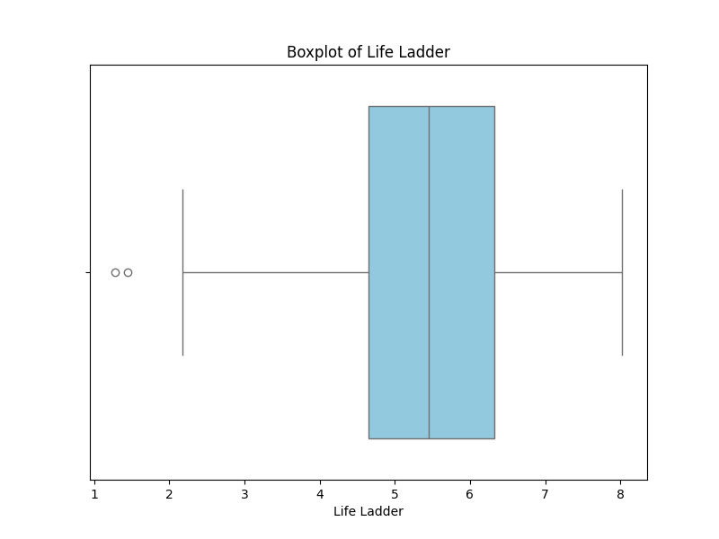
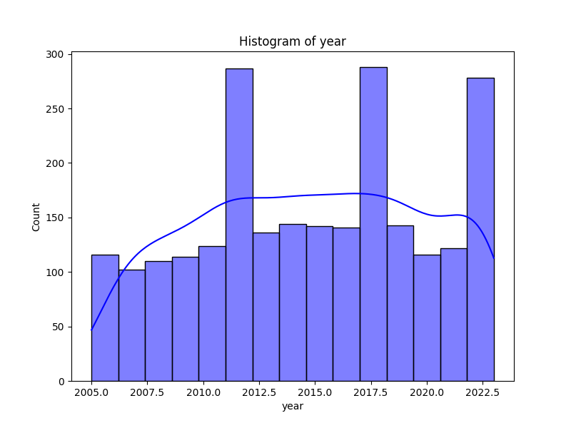
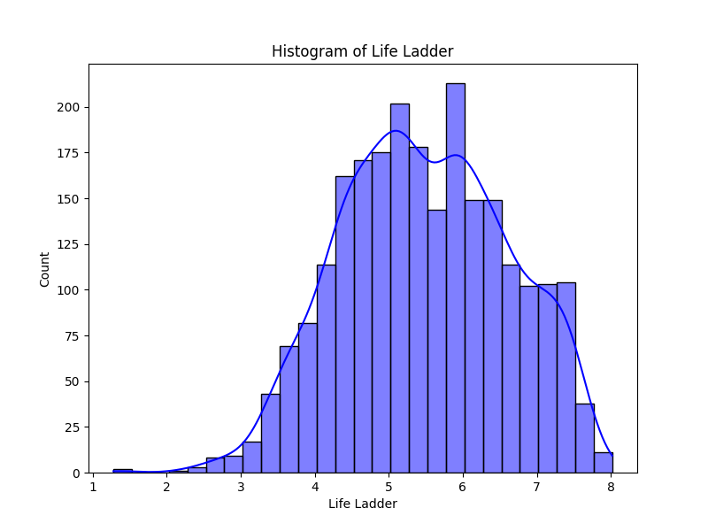
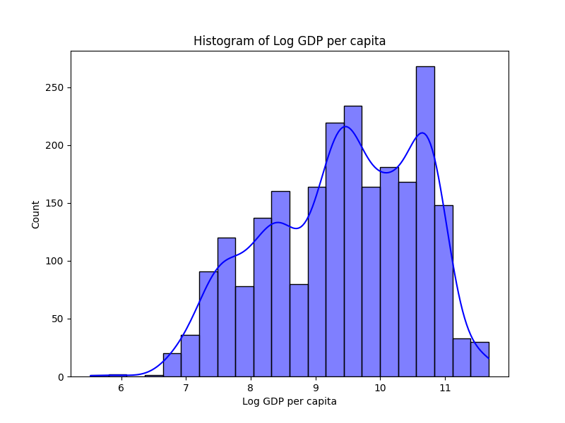

# Automated Data Analysis Report for Happiness

## Dataset: happiness.csv

### Dataset Overview
- **Columns**: ['Country name', 'year', 'Life Ladder', 'Log GDP per capita', 'Social support', 'Healthy life expectancy at birth', 'Freedom to make life choices', 'Generosity', 'Perceptions of corruption', 'Positive affect', 'Negative affect']
- **Missing Values**: {'Country name': 0, 'year': 0, 'Life Ladder': 0, 'Log GDP per capita': 28, 'Social support': 13, 'Healthy life expectancy at birth': 63, 'Freedom to make life choices': 36, 'Generosity': 81, 'Perceptions of corruption': 125, 'Positive affect': 24, 'Negative affect': 16}

### Key Insights
1. **Life Quality Indicators:** The data suggests that factors like 'Social Support' and 'Healthy Life Expectancy at Birth' significantly contribute to the overall life quality as indicated by the Life Ladder. Social support ranked as the most important feature, highlighting its critical role in well-being.
2. **Economic Influence:** 'Log GDP per capita' reflects strong economic influences on life satisfaction, but it ranks lower in importance compared to social factors, indicating that economic growth alone may not suffice for improving overall life quality.
3. **Perceptions of Corruption:** High levels of perceived corruption correlate with lower life satisfaction metrics, demonstrating the negative impact of governance and institutional trust on quality of life.
4. **Emotional Well-Being:** Positive and Negative affect balances also significantly contribute to overall life satisfaction. A higher positive affect leads to increased life satisfaction.

### Dataset Overview
- **Columns:** The dataset comprises 10 key columns related to quality of life indicators across various countries from 2005 to 2023.
- **Missing Data:** Several indicators have notable missing values, particularly 'Generosity' (81 missing), 'Perceptions of corruption' (125 missing), 'Healthy life expectancy at birth' (63 missing), and others, which may impact analysis unless properly addressed.
- **Outliers:** A number of outliers were detected in various features, pointing to potential anomalies in data that may need further investigation.
- **Population and Trends:** It includes data from 165 unique countries over the years, providing insights into global trends in quality of life.

### Key Findings
1. **Statistics Summary:** The mean Life Ladder score is around 5.48, suggesting a moderate level of life satisfaction globally. Other quality of life indicators exhibit varying degrees of variability and distribution which reflect on national differences in well-being.
2. **Outliers:** Outliers were detected in several columns; for instance:
   - 'Social support' had 48 outliers, indicating some countries may experience significantly lower or higher support levels than expected.
   - 'Perceptions of corruption' exhibited considerable variability with 194 outliers, which can skew average perceptions if not addressed.
3. **Feature Importance:** The importance of features indicates that some drivers of life satisfaction, such as 'Social Support' and 'Healthy Life Expectancy', are more impactful than others, such as 'Generosity' and 'Freedom to make life choices'.

### Recommendations
1. **Address Missing Values:** Data cleaning should be prioritized, especially for columns with substantial missing values, such as 'Generosity' and 'Perceptions of corruption'. Consider using imputation methods or omitting certain analyses that can’t accommodate the missing data.
2. **Outlier Management:** Investigate and potentially address outliers, as they can bias results and overall interpretations. Consider robustness checks that gauge the impact of these outliers on analysis conclusions.
3. **Focus on Social Policies:** Countries should consider policies that enhance social support systems and governance practices to combat corruption, as they have a significant impact on citizens' life satisfaction.
4. **Increased Data Collection:** Continuously collect and update data across all variables to allow for more precise modeling over time and better sensitivity to changing global trends.

### Conclusions
The dataset provides valuable insights into various factors affecting life satisfaction across countries. The analysis highlights that while economic factors like GDP play a role, social indicators such as support networks and perceptions of corruption are paramount to well-being outcomes. Addressing missing values and outliers, alongside prioritizing social well-being measures, will yield stronger results and deeper insights into enhancing quality of life globally.

### Outlier Detection Results
Detected outliers in 'year': 0 rows
Detected outliers in 'Life Ladder': 2 rows
Detected outliers in 'Log GDP per capita': 1 rows
Detected outliers in 'Social support': 48 rows
Detected outliers in 'Healthy life expectancy at birth': 20 rows
Detected outliers in 'Freedom to make life choices': 16 rows
Detected outliers in 'Generosity': 39 rows
Detected outliers in 'Perceptions of corruption': 194 rows
Detected outliers in 'Positive affect': 9 rows
Detected outliers in 'Negative affect': 31 rows

### Feature Importance Analysis
|    | Feature                          |   Importance |
|---:|:---------------------------------|-------------:|
|  3 | Social support                   |    0.27151   |
|  4 | Healthy life expectancy at birth |    0.107936  |
|  2 | Log GDP per capita               |    0.105402  |
|  0 | year                             |    0.104132  |
|  8 | Positive affect                  |    0.103446  |
|  7 | Perceptions of corruption        |    0.0899058 |
|  5 | Freedom to make life choices     |    0.074778  |
|  1 | Life Ladder                      |    0.0742228 |
|  6 | Generosity                       |    0.0686676 |

### Visualizations

## Suggestions

Here are several analyses that could yield meaningful insights from the dataset you provided:

1. **Correlation Analysis**:
   - Investigate the correlation between variables, especially how factors like 'Log GDP per capita', 'Social support', and 'Freedom to make life choices' relate to 'Life Ladder'. This can reveal which factors most strongly influence overall life satisfaction.

2. **Missing Data Analysis**:
   - Explore patterns of missing data, especially in columns like 'Generosity' and 'Perceptions of corruption'. Understand if the missing data is random or if there are specific countries or years that have a higher rate of missing values. This can inform potential imputation strategies.

3. **Trend Analysis Over Time**:
   - Create time series analyses to examine how countries' 'Life Ladder' scores and other metrics have changed over the years. This can help identify trends and shifts in life satisfaction alongside economic changes.

4. **Comparison of Regions**:
   - Segment the data by region (e.g., using the country names) and compare metrics like 'Life Ladder', 'Log GDP per capita', and 'Healthy life expectancy at birth' across regions. This can illustrate disparities between different areas of the world.

5. **Clustering Analysis**:
   - Utilize clustering techniques (e.g., K-means or hierarchical clustering) to group countries based on similar profiles across various metrics. This can help identify clusters of countries that share similar characteristics in terms of life satisfaction and its contributing factors.

6. **Predictive Modeling**:
   - Build regression models to predict 'Life Ladder' based on other variables. This could help in forecasting life satisfaction and understanding how changes in the economy or social support can impact overall life satisfaction.

7. **Impact of GDP on Life Satisfaction**:
   - Perform a detailed analysis to see how 'Log GDP per capita' affects the 'Life Ladder' across different countries, especially looking into outliers or countries that deviate from expected patterns. 

8. **Examine Positive and Negative Affect**:
   - Analyze the relationship between 'Positive affect' and 'Negative affect' with 'Life Ladder' to see how these emotional factors play into overall life satisfaction.

9. **Categorical Variable Analysis**:
   - If country-specific or regional categorizations can be established, use categorical analysis techniques to understand how different groups fare in terms of metrics like 'Freedom to make life choices' and 'Perceptions of corruption'.

10. **Longitudinal Analysis of Individual Countries**:
    - Select a few countries and perform a longitudinal analysis over the years to see how life satisfaction and related metrics have evolved in those specific contexts.

11. **Factor Analysis**:
    - Conduct a factor analysis to identify underlying relationships between variables such as 'Social support', 'Healthy life expectancy at birth', and the emotional metrics. This can help distill the dataset into fewer dimensions that capture the core aspects of life satisfaction.

12. **Impact of Corruption Perception**:
    - Analyze how 'Perceptions of corruption' influences 'Life Ladder' in various countries. This analysis could highlight the importance of governance and social trust in citizens' well-being.

These suggested analyses can help you uncover valuable insights from the dataset, making it informative for policymakers, researchers, and other stakeholders interested in well-being and life satisfaction metrics.

