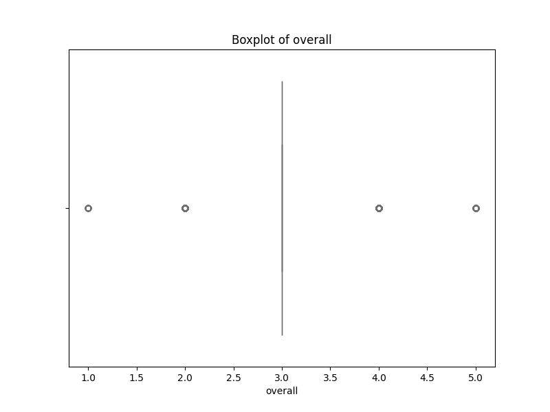
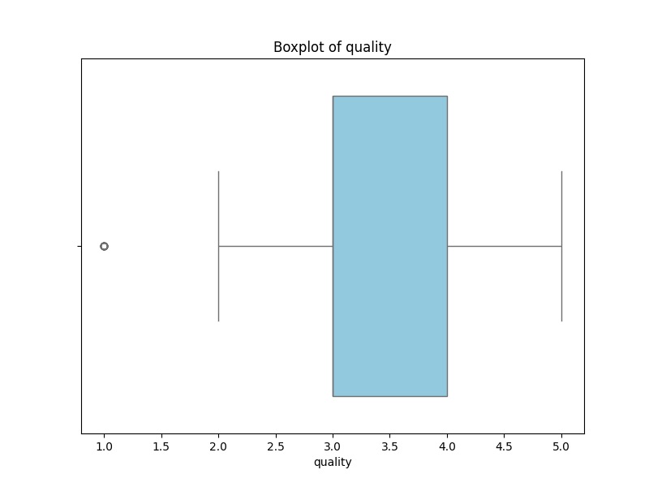
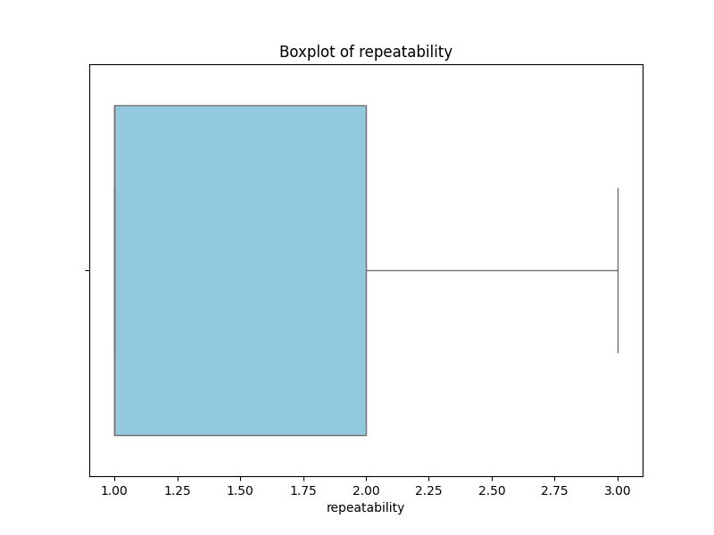
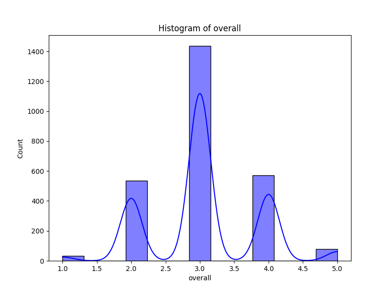
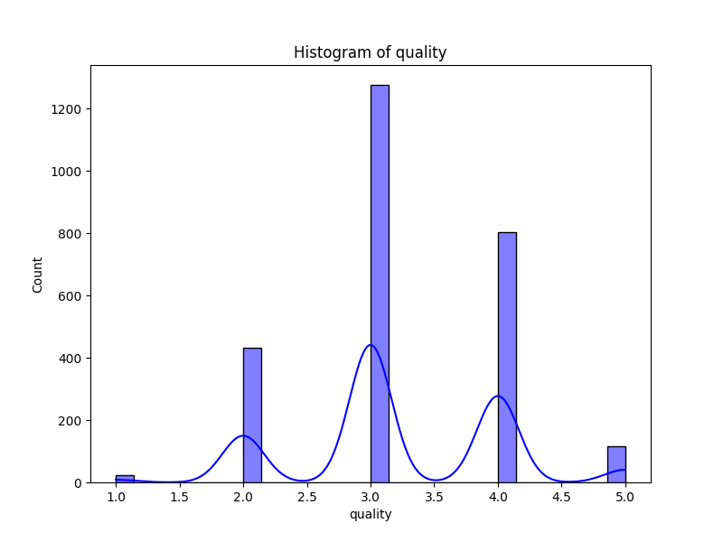
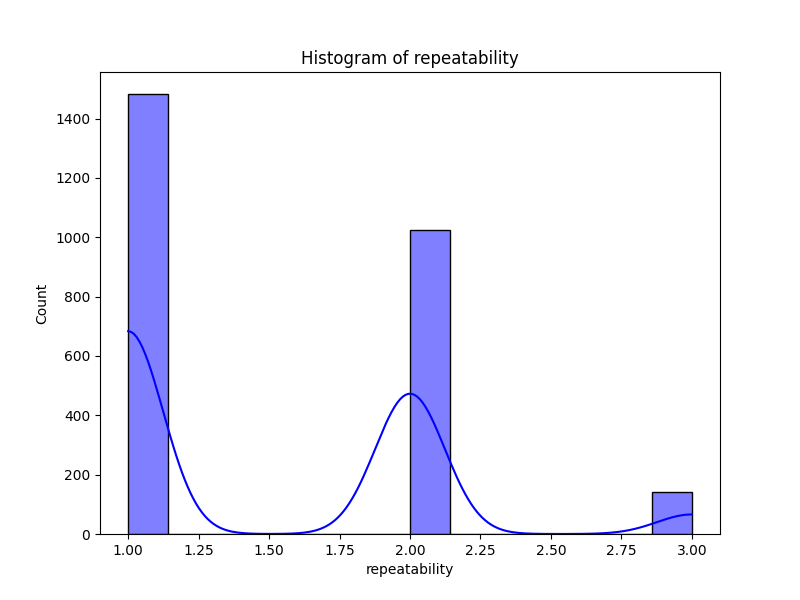

# Automated Data Analysis Report for Media

## Dataset: media.csv

### Dataset Overview
- **Columns**: ['date', 'language', 'type', 'title', 'by', 'overall', 'quality', 'repeatability']
- **Missing Values**: {'date': 99, 'language': 0, 'type': 0, 'title': 0, 'by': 262, 'overall': 0, 'quality': 0, 'repeatability': 0}

### Key Insights
1. **Missing Values**: The dataset has a notable number of missing values in the 'date' (99 rows) and 'by' (262 rows) columns, which could impact analyses that rely on these aspects.
2. **Outlier Detection**: A significant portion of records, particularly in 'overall' ratings, show outlier characteristics, indicating variability or potential issues in assessment.
3. **Language and Type Distribution**: The dataset predominantly consists of content in English (1306 instances) and is mainly categorized as movies (2211 instances).

### Dataset Overview
- **Total Records**: 2652
- **Columns**: The dataset includes key attributes about content, such as publication date, language, type, title, author or creator, scoring metrics (overall, quality, repeatability).
- **Unique Values**: Notably, there are many unique titles (2312) and contributors (1528), reflective of a diverse dataset.

### Key Findings
1. **Rating Distributions**:
   - **Overall Ratings**: The mean overall rating is approximately 3.05 with a standard deviation of 0.76, indicating a generally positive reception yet with considerable spread.
   - **Quality Ratings**: The average quality rating is around 3.21, suggesting favorable content quality perception.
   - **Repeatability Ratings**: The average is significantly lower, at about 1.49, indicating that users show less consensus on content’s repeatability.

2. **Feature Importance**: Analysis reveals that 'overall' ratings are the most important feature impacting feedback, with an importance of about 82.17%, compared to 'quality' at about 17.83%.

3. **Outlier Impact**: Most outliers were found in the 'overall' feature, suggesting that a significant number of ratings may deviate from the norm, possibly skewing the average feedback.

### Recommendations
1. **Data Cleaning**: Address the missing values, particularly in the 'date' and 'by' columns, as these can significantly impact analyses and interpretations.
2. **Outlier Management**: Investigate the outliers in the 'overall' ratings to understand their implications on the data, potentially by reviewing additional measures such as median or mode for summary statistics.
3. **Enhance Repeatability Scores**: Since repeatability scores are significantly lower, consider exploring user feedback further to glean insights on what determines repeatability in the context of this dataset, and reflect on how to enhance this aspect in content production or selection.

### Conclusions
The dataset presents a rich resource for analyzing user engagement with content through varied metrics. While overall and quality ratings are favorable, the significant presence of outliers and low repeatability scores suggest an area for deeper investigation. Addressing missing values is crucial for ensuring robustness in any further analysis. Prioritizing improvements in the metrics associated with repeatability may enhance the overall user satisfaction and content quality perceptions moving forward.

### Outlier Detection Results
Detected outliers in 'overall': 1216 rows
Detected outliers in 'quality': 24 rows
Detected outliers in 'repeatability': 0 rows

### Feature Importance Analysis
|    | Feature   |   Importance |
|---:|:----------|-------------:|
|  0 | overall   |     0.821653 |
|  1 | quality   |     0.178347 |

### Visualizations

## Suggestions

Based on the provided dataset summary, here are several analyses that could yield meaningful insights:

1. **Missing Value Analysis**:
   - Investigate the missing values in the `date` and `by` columns. Explore patterns or connections between missing values and other columns. For example, check if certain `language` or `type` have a higher proportion of missing creators.

2. **Time Series Analysis**:
   - Convert the `date` column into a date format and analyze trends over time. You could visualize the number of entries per year/month and track how ratings (`overall`, `quality`, and `repeatability`) have changed over time. 

3. **Rating Distributions**:
   - Analyze the distribution of the `overall`, `quality`, and `repeatability` ratings. Create histograms or box plots to identify patterns in ratings and potential outliers.

4. **Language and Type Analysis**:
   - Examine the relationship between language and type. Are certain types (e.g., movies vs. shows) more prevalent in certain languages? This can be visualized through grouped bar charts.

5. **Correlational Analysis**:
   - Calculate and visualize the correlations between `overall`, `quality`, and `repeatability` ratings. This will help to understand how these ratings relate to each other.

6. **Top Contributors**:
   - Analyze the `by` column to identify the most common contributors and correlate their works with overall ratings. This could reveal if certain contributors have higher average ratings.

7. **Title Popularity**:
   - Assess the popularity of titles based on their frequency and average ratings. This could help identify trends in viewer preferences.

8. **Quality vs. Repeatability**:
   - Investigate whether there is any significance to how quality impacts repeatability. For instance, do higher-quality ratings lead to a higher repeatability score?

9. **Segment Analysis**:
   - Break down the data by `language` and `type` to analyze the average ratings per segment. This could allow for comparisons between segments.

10. **Trend Analysis on Popular Titles**:
    - Identify trends among the highest-rated titles and see if there's a pattern in the `by` contributors or if they belong to specific genres or languages.

11. **Alert for Quality Ratings**:
    - Set up alerts for titles where the quality and repeatability ratings diverge significantly (e.g., high quality but low repeatability) as these could represent anomalies or interesting cases for further investigation.

12. **Exploring Creator Impact**:
    - Conduct analyses to assess whether certain creators (from the `by` column) tend to receive higher ratings across their works. 

By conducting these analyses, you will gain insights into the dataset's structure, trends, and anomalies that could be valuable for decision-making, recommendations, or further research.

