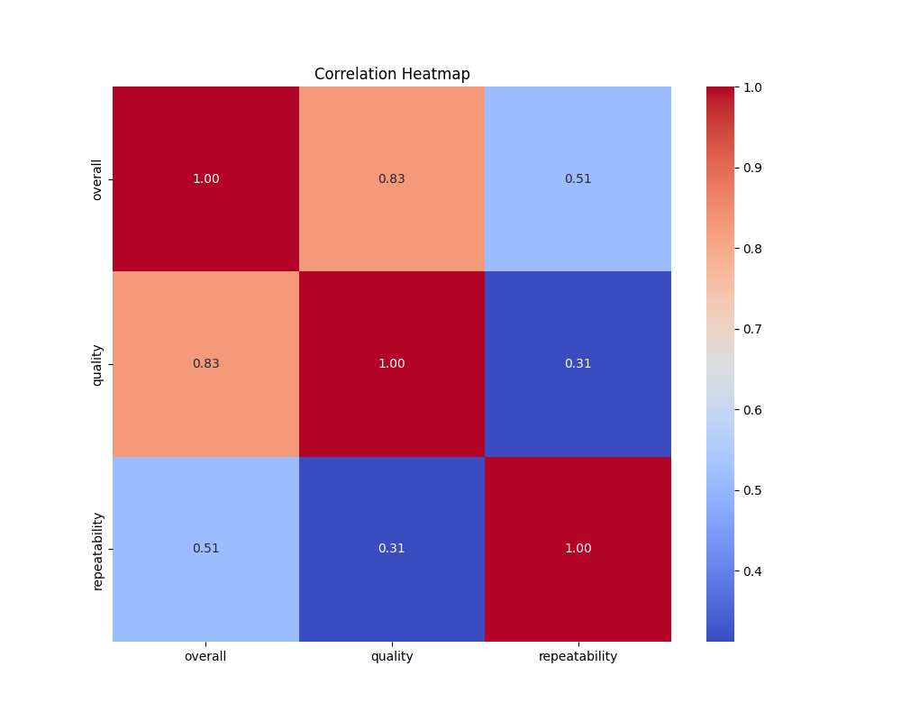

# Automated Data Analysis Report for Media

## Dataset: media.csv

### Dataset Overview
- **Columns**: ['date', 'language', 'type', 'title', 'by', 'overall', 'quality', 'repeatability']
- **Missing Values**: {'date': 99, 'language': 0, 'type': 0, 'title': 0, 'by': 262, 'overall': 0, 'quality': 0, 'repeatability': 0}

### Key Insights
1. **Data Quality Challenges**: The dataset has a significant number of missing values, particularly in the 'date' (99 missing) and 'by' (262 missing) fields, which may affect the reliability of any analysis performed.
2. **Outlier Presence**: A considerable number of outliers were detected in the 'overall' (1216 outliers) and 'quality' (24 outliers) ratings, indicating potential data integrity issues or the presence of extreme values that might skew the results.
3. **Feature Importance**: The analysis reveals that 'overall' score is the most influential feature in predicting outcomes, with a feature importance score of 82%, compared to 'quality' which accounts for 18%. This suggests that the 'overall' rating may be a more critical variable for analysis.

### Dataset Overview
- The dataset contains **2652 entries** across **8 columns**: 'date', 'language', 'type', 'title', 'by', 'overall', 'quality', and 'repeatability'.
- The 'language' and 'type' features remain consistent with no missing values, while 'date' and 'by' exhibit significant gaps.
- The 'overall' score has a mean of approximately 3.05 and falls within a range from 1 to 5. Similarly, the 'quality' score boasts a mean of about 3.21. The repeatability scores are lower, with a mean of around 1.49.

### Key Findings
- **Language and Type Diversity**: The dataset comprises 11 unique languages and 8 unique types, with 'English' being the most common language and 'movie' the most frequent type.
- **High Frequency Titles**: The title 'Kanda Naal Mudhal' has been recorded 9 times, indicating popular content or frequent reviews.
- **Overall Ratings Distribution**: A significant portion of overall ratings falls around the central score of 3, hinting at a tendency towards average ratings.

### Recommendations
1. **Data Cleaning**: Address the missing values, especially in critical fields such as 'date' and 'by', to improve the completeness of the dataset. Consider techniques like imputation where applicable.
2. **Outlier Treatment**: Investigate the outliers detected in 'overall' and 'quality' ratings. Depending on the context, consider removing or further evaluating these entries to ensure a cleaner analysis.
3. **Further Analysis on Productivity of Features**: Conduct deeper research into how 'overall' and 'quality' ratings could correlate with other factors such as 'by' (reviewer) and 'language', enhancing understanding of what drives higher or lower scores.
4. **Data Visualization**: Utilize visual tools to represent the distribution of 'overall', 'quality', and 'repeatability' scores. This can help identify patterns and trends that may not be immediately evident from summary statistics.

### Conclusions
The dataset offers a rich tapestry of insights related to film reviews, particularly related to overall and quality metrics. However, the presence of missing values and outliers poses considerable challenges for reliable analysis. By addressing these data issues and utilizing the most impactful features, one can gain clearer insights into trends and patterns that exist within this dataset. Future analyses should focus on improving data integrity, understanding the implications of outlier scores, and exploring relationships between different features for deeper analysis.

### Outlier Detection Results
Detected outliers in 'overall': 1216 rows
Detected outliers in 'quality': 24 rows
Detected outliers in 'repeatability': 0 rows

### Feature Importance Analysis
|    | Feature   |   Importance |
|---:|:----------|-------------:|
|  0 | overall   |     0.821653 |
|  1 | quality   |     0.178347 |

### Correlation Heatmap

## Suggestions

Based on the summary you provided, here are several analyses you could conduct to yield meaningful insights from the dataset:

1. **Trend Analysis Over Time**:
   - Analyze how the number of entries has changed over time by plotting the count of entries against the 'date' column. This could highlight trends in submissions, such as increases or decreases in the frequency of reviews over specific years or periods.

2. **Language Popularity**:
   - Count the number of entries for each language. This can help you understand the distribution of languages used and identify the most popular languages in your dataset.

3. **Type-based Analysis**:
   - Analyze the distribution of entries across different types (movies, shows, etc.). You could visualize this distribution with a bar chart, which can reveal what types of media are most commonly reviewed.

4. **Aggregate Rating Analysis**:
   - Compute the average ratings for 'overall', 'quality', and 'repeatability' across different languages and types. This can provide insights into how different categories are perceived and rated.

5. **Correlations Among Ratings**:
   - Evaluate the correlation between the three rating metrics: overall, quality, and repeatability. This can help identify how these ratings relate to each other, which might indicate if higher quality reviews are associated with higher overall ratings.

6. **Author Analysis**:
   - Analyze the most active reviewers by counting entries per 'by' (author) and checking their average ratings. This could provide insights into who the most influential reviewers are and how their reviews compare in quality.

7. **Missing Values Analysis**:
   - Investigate the missing values in the 'date' and 'by' columns. Explore the patterns related to missing entries. For example, you could check if missing 'by' values tend to be associated with lower ratings or specific types or languages.

8. **Sentiment Analysis (if applicable)**:
   - If there are textual reviews or comments related to each entry in the dataset (though not indicated in the summary), conduct a sentiment analysis to determine the general sentiment conveyed in reviews by language, type, or author.

9. **Quality and Repeatability Analysis**:
   - Investigate the ratios of 'quality' and 'repeatability' ratings to see if there are any significant trends or patterns. For example, do higher quality ratings correlate with higher repeatability?

10. **Highest and Lowest Rated Entries**:
    - Identify the titles with the highest and lowest overall ratings to understand what features might contribute to higher or lower scores.

11. **Comparative Analysis Across Different Groups**:
    - If there are multiple languages and types, consider conducting comparative analyses of the average ratings or frequencies to see if specific groups show consistent differences.

By performing these analyses, you can extract a wide range of insights regarding trends in media consumption, reviewer behavior, and the perceived quality of different types of media in various languages.

