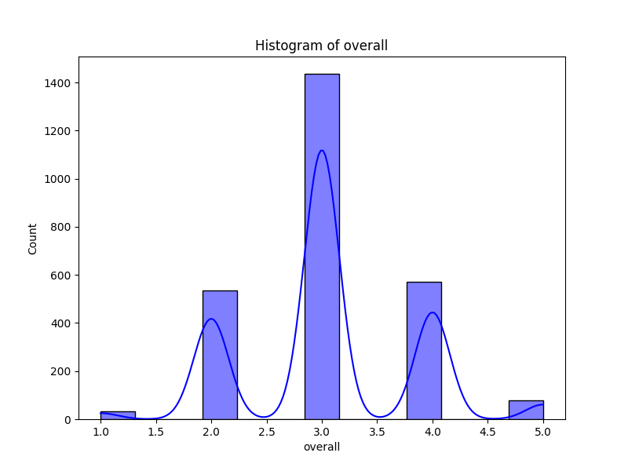
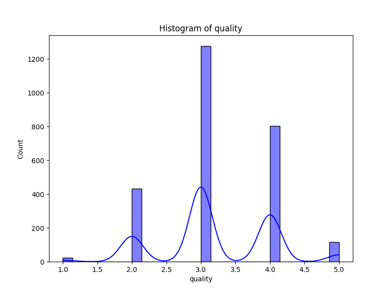
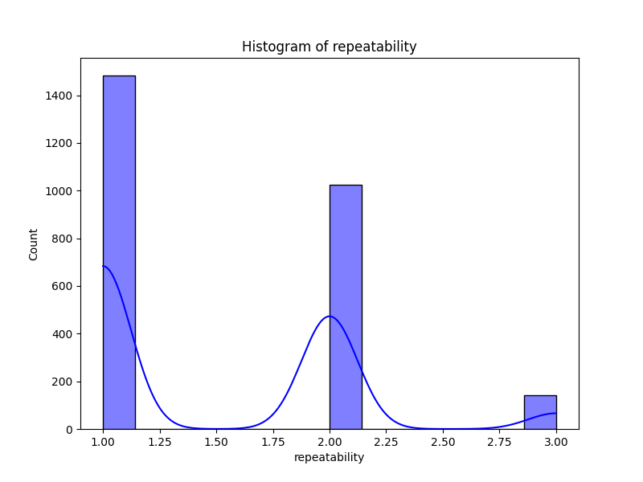

# Automated Data Analysis Report for Media

## Dataset: media.csv

### Dataset Overview
- **Columns**: ['date', 'language', 'type', 'title', 'by', 'overall', 'quality', 'repeatability']
- **Missing Values**: {'date': 99, 'language': 0, 'type': 0, 'title': 0, 'by': 262, 'overall': 0, 'quality': 0, 'repeatability': 0}

### Key Insights
### Key Insights
1. **Missing Values:** The dataset has 99 missing values in the 'date' column and 262 missing values in the 'by' column. This could potentially impact the analysis if these fields hold significant importance.
2. **Dominant Entries:** The majority of entries are in English (1306 instances) and pertain to the "movie" type (2211 instances).
3. **Rating Averages:** The overall ratings have a mean of approximately 3.05, while the quality ratings average at around 3.21. The repeatability rating, however, is significantly lower with a mean of about 1.49, suggesting it might need further investigation.
4. **Variety of Titles and Contributors:** There are 2312 unique titles and 1528 unique contributors, indicating a rich dataset of films and reviewers.

### Dataset Overview
- The dataset comprises 2652 entries with 8 relevant columns including 'date', 'language', 'type', 'title', 'by', 'overall', 'quality', and 'repeatability'.
- Columns like 'language' and 'type' serve categorical roles with a limited range of unique values.
- The numerical columns 'overall', 'quality', and 'repeatability' provide insights into the evaluation of films.

### Key Findings
- **Temporal Distribution:** The presence of 99 missing entries in the 'date' column indicates a gap in temporal analysis, which may limit understanding of trends over time.
- **Reviewer Identity and Contribution Gaps:** The substantial number of missing values in the 'by' column could affect the ability to analyze the reputation or influence of specific reviewers on overall ratings.
- **Quality vs. Repeatability:** The discrepancy between the mean ratings of quality and repeatability suggests that while films are rated fairly favorably, repetition or consistency in ratings is not as strong, potentially signaling issues in reliability.

### Recommendations
1. **Data Cleaning:** Address the missing values in both 'date' and 'by' columns through imputation or other methods. Analyze the impact of these missing entries on overall conclusions.
2. **Trend Analysis:** Once data cleaning is complete, perform a time-series analysis on ratings to observe trends and changes in viewer preferences over time.
3. **Correlation Analysis:** Investigate the correlation between ‘overall’ and the other fields, especially 'quality' and 'repeatability', to uncover deeper insights into factors influencing ratings.
4. **Focus on Repeatability:** Investigate the repeatability ratings further, as they have notable discrepancies compared to overall quality and ratings, which may reveal inconsistencies in user behavior or review standards.

### Conclusion
The dataset is rich in content with numerous unique titles and contributors, but the presence of missing values in key columns hinders comprehensive analysis. With proper data cleaning and further analysis focused on trends and consistency, valuable insights can be uncovered about film ratings and viewer preferences. Addressing the discrepancies in repeatability is particularly crucial for improving the reliability of the evaluations presented in the dataset.

### Outlier Detection Results
Detected outliers in 'overall': 1216 rows
Detected outliers in 'quality': 24 rows
Detected outliers in 'repeatability': 0 rows

### Feature Importance Analysis
|    | Feature   |   Importance |
|---:|:----------|-------------:|
|  0 | overall   |     0.821653 |
|  1 | quality   |     0.178347 |

### Correlation Analysis
Correlation Matrix saved as C:\Users\Abdul Hadi\Desktop\TdsProject2\media\correlation_matrix.png

### Visualizations

